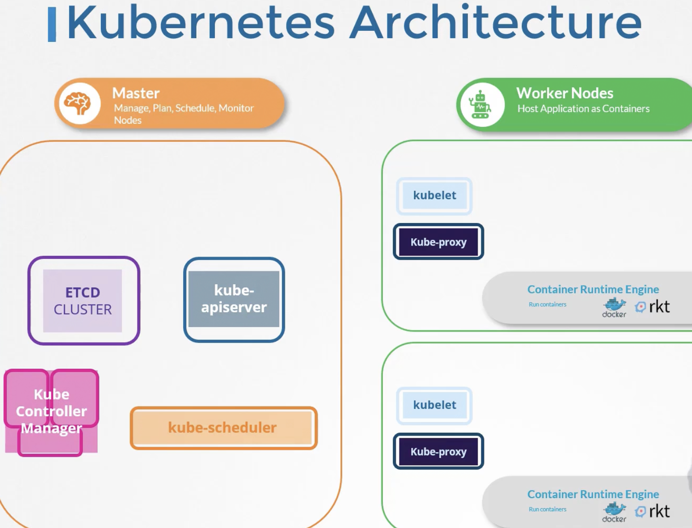

# Cluser Architecture
> Kubernetes Architecture
> ETCD
> Kube-API Server
> Controller Managers
> Kube Scheduler - Decides which k8s worker node to put a container on based on capacity
> Kubelet - Runs on each node in a cluster, listens to instructions from kube-api server to create or destroy k8s objects
- KubeAPI periodically fetches status of nodes and containers from Kubelet
> Kube Proxy - Ensures containers of different nodes can talk to each other and such rules are in place.

Master Nodes:
    - Responsible for Managing , Planing, Scheduling ,Monitoring, Nodes using control plane components

