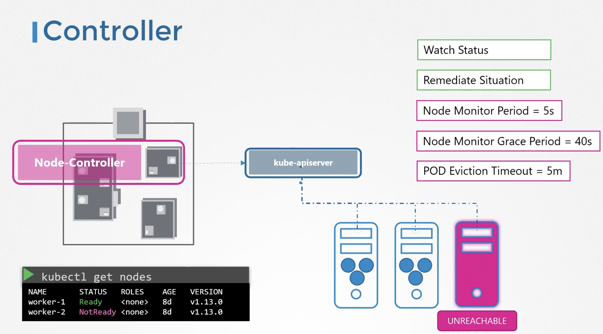
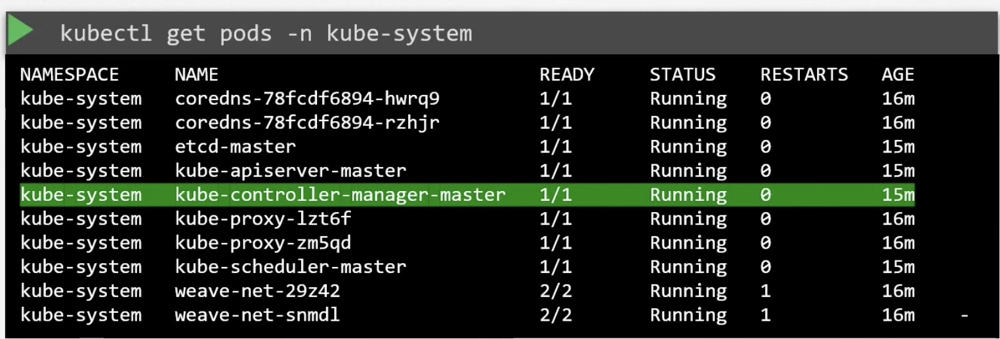

# Kube controller manager
Controller process continiously monitors state of various components within system and works towards bringing whole system to the desired state

## Node Controller 



Watches state of nodes ,healthy nodes sends heartbeat to kube-api-server every 5s
if no heartbeat is recieved until 40s , it ll allow 5m to node to comeup and then evict pods and schedule to them to healthy nodes

## Replication Controller
Monitors that desired number of pods are running at all times and if a pod dies , it creates another one.

More examples of controller
- Deployment Controller
- Namespace Controller
- Endpoint Controller
- Cron Job
- Service Account Controller
- Job Controller
- PV Protection Controller
- PV Binder Controller
- Stateful Set Controller
- Node-Controller
- Replica-set
- Replication Controller


## Installing and managing kube controller manager
* We can select which controller enable via ```--controllers``` option

When installed via kubeadm 
```kubectl get pods -n kube-system```


```cat /etc/kubernetes/manifests/kube-controller-manager.yaml```
