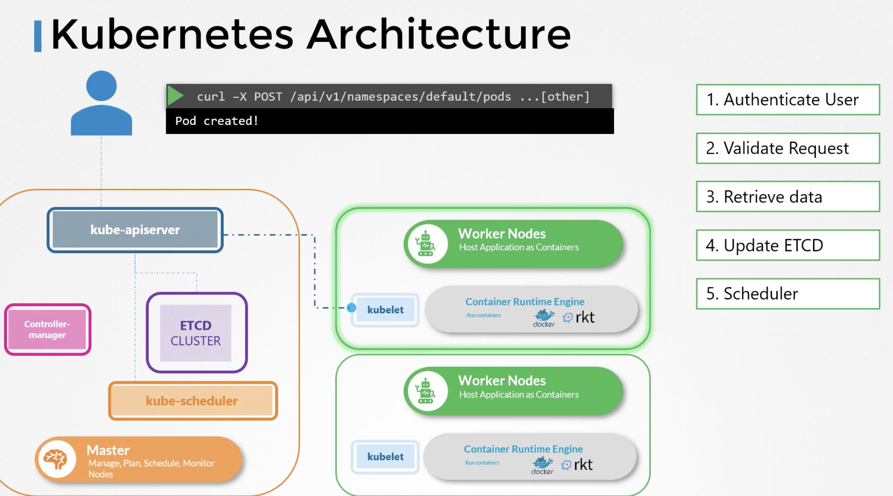

# KUBE API SERVER
API Server is the primary managment component.
kubectl utility reaches kube-api server

1. Authenticate User
2. Validate Request
3. Retrieve Data
4. Update ETCD
5. Scheduler 
6. Kubelet
