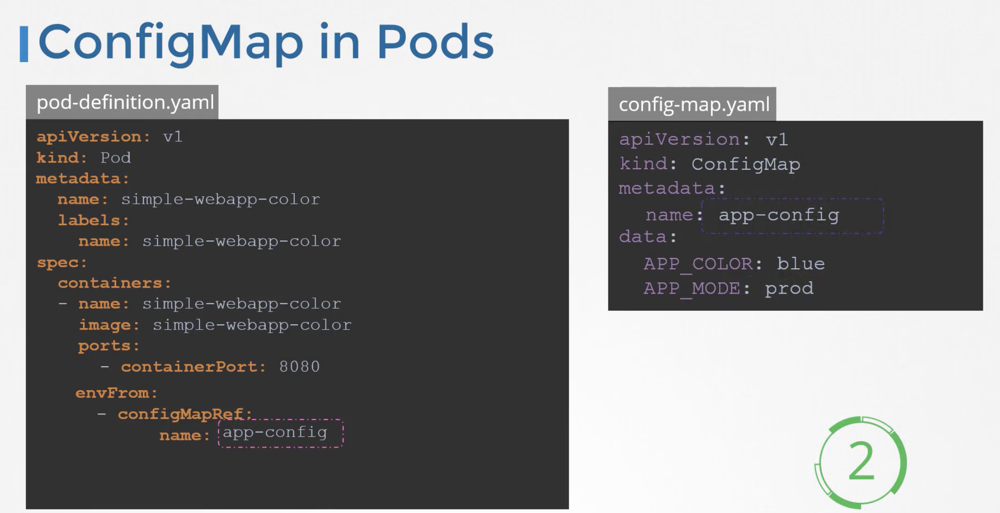

# CONFIG MAP

Creating cm imperative way

```
kubectl create configmap \
    app-config --from-literal=APP_COLOR=blue \
               --from-literal=KEY=value
```

Creating cm declarative approach

```
apiVersion: v1
kind: ConfigMap
metadata:
    name: config-map
data:
    APP_COLOR: blue
    APP_MODE: prod
```

Configuring pods with this config


```
apiVersion: v1
kind: Pod
metadata: 
    name: simple-web-color
    labels:
        name: simple-webapp-color
spec:
    containers:
    - name: simple-webapp-color
      image: simple-webapp-color
      port: 
      - containerPort: 8080
      envFrom:
        - configMapRef:
            name: app-config
```
