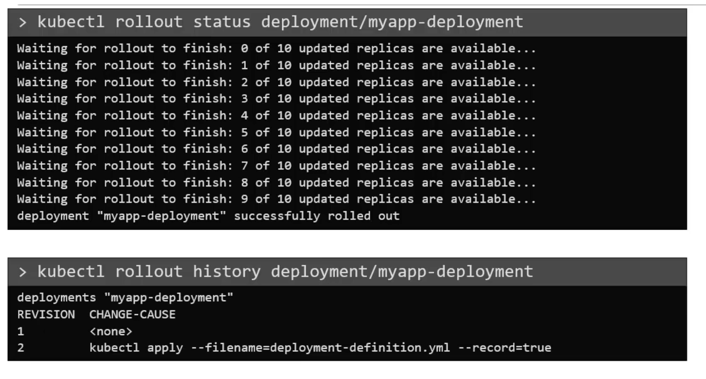
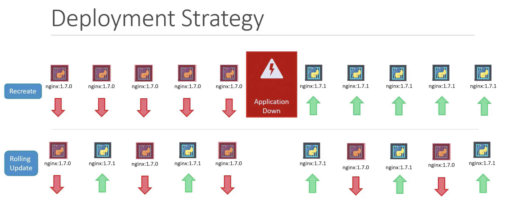
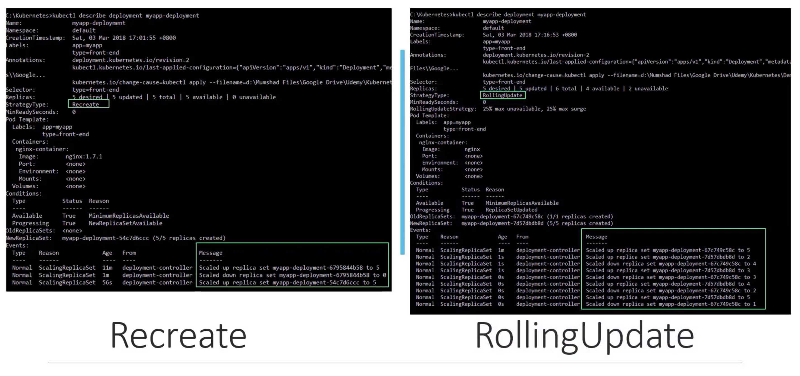
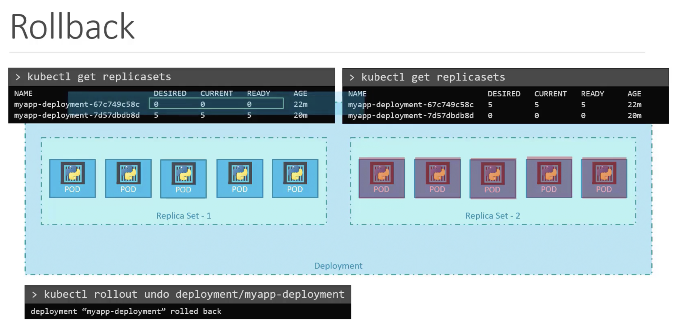

```kubectl rollout status deployment/my-app-deployment```

```kubectl rollout history deployment/my-app-deployment```




## Deployment Strategy

1. Recreate 


By default rolling update strategy


Updating deploying 
1. Either by changing image in deployment manifest
```kubectl create -f new-deployment.yaml``` 

or 

2. ```kubectl set image deployment/my-deployment nginx-container=nginx:1.2.3```
Notice when recreate - The older version was scaled down to 0 and then scaled up 


### Undo a change / rollback

```kubectl rollback undo deployment/my-app-deployment```
Deployment will create old replica-set and destroy new one

