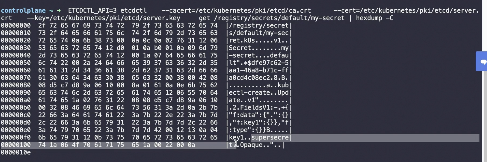

# Secrets 
By default all K8s secrets are base64 encrypted, and can seen inside etcd in plain text

## Encrypting secret data at rest
All secrets are stored in plain test in etcd.


```
## Install etcdctl - apt-get etcdctl

ETCDCTL=3 etcdctl \
   --cacert=/etc/kubernetes/pki/etcd/ca.crt   \
   --cert=/etc/kubernetes/pki/etcd/server.crt \
   --key=/etc/kubernetes/pki/etcd/server.key  \
   get /registry/secrets/default/secret1 | hexdump -C
```
Check if kube-api server has encryption at rest enabled or not.
We are looking for --encryption-provider-config option in kube-api process
```ps -aux | grep kube-api | grep "encryption-provider-config" ```


or verify this in kube-api configuration
```cat /etc/kubernetes/manifests/kube-apiserver.yaml ```

If absent , create a ```Encryption an configuration manifest and pass this as an arg to kube-api```

Use appropriate provider (selecting encryption alogirthm)

EncryptionConfiguration Manifest

/etc/kubernetes/enc/enc.yaml

```
apiVersion: apiserver.config.k8s.io/v1
kind: EncryptionConfiguration
resources:
  - resources:
      - secrets ## Only secrets are going to be encrypted
    providers:
      - aescbc:
          keys:
            - name: key1
              secret: <BASE 64 ENCODED SECRET>  ## Will be used to encrypt
      - identity: {} # REMOVE THIS LINE
```

Edit the manifest for the kube-apiserver static pod: ```/etc/kubernetes/manifests/kube-apiserver.yaml``` so that it is similar to:

```
---
#
# This is a fragment of a manifest for a static Pod.
# Check whether this is correct for your cluster and for your API server.
#
apiVersion: v1
kind: Pod
metadata:
  annotations:
    kubeadm.kubernetes.io/kube-apiserver.advertise-address.endpoint: 10.20.30.40:443
  creationTimestamp: null
  labels:
    app.kubernetes.io/component: kube-apiserver
    tier: control-plane
  name: kube-apiserver
  namespace: kube-system
spec:
  containers:
  - command:
    - kube-apiserver
    ...
    - --encryption-provider-config=/etc/kubernetes/enc/enc.yaml  # add this line - Tells where is encryption file
    volumeMounts:
    ...
    - name: enc                           # add this line
      mountPath: /etc/kubernetes/enc      # add this line
      readOnly: true                      # add this line
    ...
  volumes:
  ...
  - name: enc                             # add this line
    hostPath:                             # add this line
      path: /etc/kubernetes/enc           # add this line
      type: DirectoryOrCreate             # add this line
  ...
```

Restart API-Server


## Kubernetes handles secrets in --- such a  way

* A secret is only sent to a node if a pod on that node requires it.
* Kubelet stores the secret into a tmpfs so that the secret is not written to disk storage.
* Once the Pod that depends on the secret is deleted, kubelet will delete its local copy of the secret data as well.


