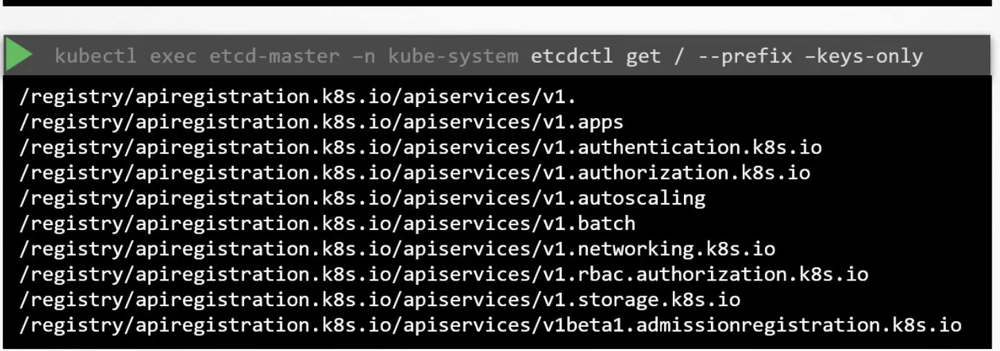
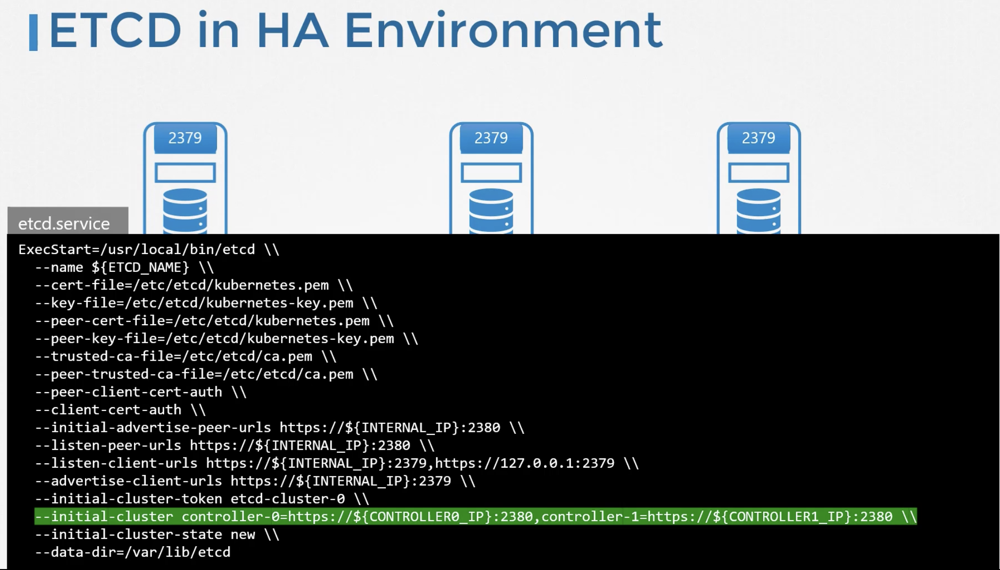

ETCD is a key-value store
--
Etcd stores information about cluster 
- nodes
- pods
- configs
- secrets
- accounts
- roles
- bindings

 Any change in k8s is considered to be complete when the etcd server is updated

-- If we deploy cluster from scratch , we need to install and configure etcd in master node ourselves by setting ```--advertise-client-urls``` option

-- If we use kubeadm , etcd is installed as a pod ```kubectl get pods -n kube-system``` and etcd database can be explored using etcdctl utility inside this pod.
eg: kubectl exec etcd-master -n kube-system etcdctl get / --prefix -keys-only


-- In a highly available environment , multiple replicas of etcd will exist
