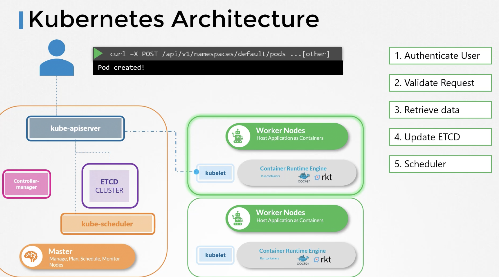

# KUBE API SERVER
API Server is the primary managment component.
kubectl utility reaches kube-api server



1. Authenticate User
2. Validate Request
3. Retrieve Data
4. Update ETCD
5. Scheduler 
6. Kubelet

Viewing kube-api-server in an existing cluster

- when api-server is installed via kubeadm
```cat /etc/kubernetes/manifests/kube-apiserver.yaml```
- When api-server was installed manuall
```cat /etc/systemd/system/kube-apiserver.service```
- Can also look at process
```ps -aux | grep kube-apiserver```


