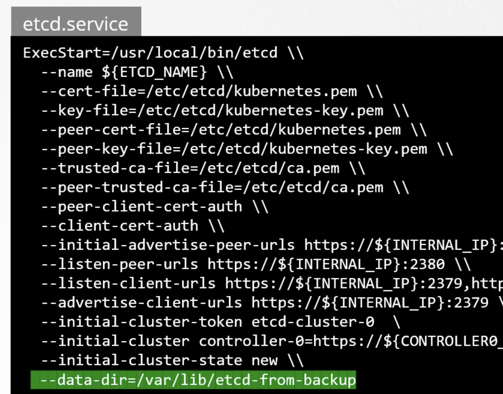

# Back-up candidates
* - Resource Configuration
* - ETCD Cluster
* - Persistent Volumes

Etcd is hosted on master node
all this data is stored in 
```--data-dir=/var/lib/etcd```

* take snapshot of etcd
```etcdctl snapshot save snapshot.db```

* stop kube-api server , as it depends on etcd
```service kube-apiserver stopped```

* Run restore 
```etcdctl snapshot restore snapshot.db --data-dir /var/lib/etcd-for-backup```

When etcd restores from a backup it will initialise a new cluster configuration and configures the members to a new cluster to prevent a new member form accidently joining a cluster. 

Then configure etcd again with new backup data location.



Then restart kube-api service

To interact with etcd ```etcdctl``` 

To make use of etcdctl for tasks such as back up and restore, make sure that you set the ETCDCTL_API to 3.
```export ETCDCTL_API=3```


For TLS Enabled Etcd 
–cacert                      verify certificates of TLS-enabled secure servers using this CA bundle
–cert                        identify secure client using this TLS certificate file
–endpoints=[127.0.0.1:2379]  This is the default as ETCD is running on master node and exposed on localhost 2379.
–key                         identify secure client using this TLS key file

Save snapshot

```
ETCDCTL_API=3 etcdctl --endpoints=https://192.36.64.6:2379 --cacert=/etc/kubernetes/pki/etcd/ca.crt --cert=/etc/kubernetes/pki/etcd/server.crt --key=/etc/kubernetes/pki/etcd/server.key snapshot save /opt/cluster1.db
Snapshot saved at /opt/cluster1.db
```

If you want to find these flags etcd , describe kube-api , or if etcd is not stacked (deployed differently outside a pod) , check ps -ef find args from there.

```

/usr/local/bin/etcd --name etcd-server --data-dir=/var/lib/etcd-data --cert-file=/etc/etcd/pki/etcd.pem --key-file=/etc/etcd/pki/etcd-key.pem --peer-cert-file=/etc/etcd/pki/etcd.pem --peer-key-file=/etc/etcd/pki/etcd-key.pem --trusted-ca-file=/etc/etcd/pki/ca.pem --peer-trusted-ca-file=/etc/etcd/pki/ca.pem --peer-client-cert-auth --client-cert-auth --initial-advertise-peer-urls https://192.36.232.6:2380 --listen-peer-urls https://192.36.232.6:2380 --advertise-client-urls https://192.36.232.6:2379 --listen-client-urls https://192.36.232.6:2379,https://127.0.0.1:2379 --initial-cluster-token etcd-cluster-1 --initial-cluster etcd-server=https://192.36.232.6:2380 --initial-cluster-state new


ETCDCTL_API=3 etcdctl member list --endpoints=https://192.36.232.6:2379 \
--cacert=/etc/etcd/pki/ca.pem \
--cert=/etc/etcd/pki/etcd.pem \
--key=/etc/etcd/pki/etcd-key.pem
```

When restoring a non-k8s etcd , restore snapshot from a new location 
```etcdctl snapshot restore snapshot.db --data-dir /var/lib/etcd-for-backup```
to ensure no old config is used.

modify startup service to use this path and restart service.
Also restart all k8s control plane components and kubelet