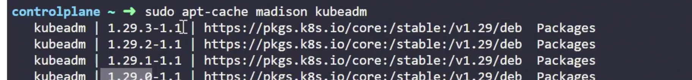
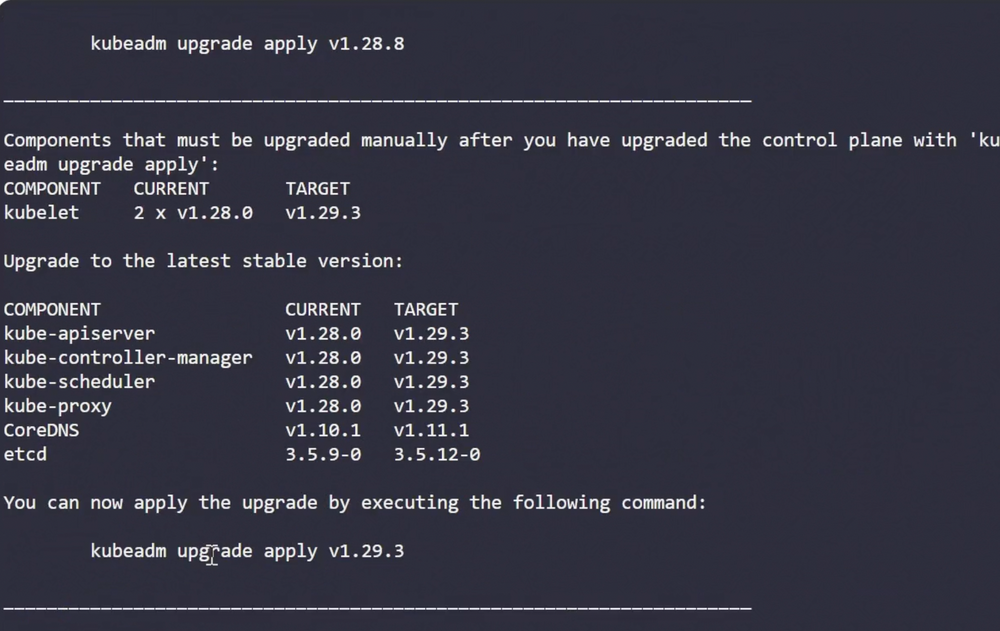

# Upgrading using kubeadm

Always upgrade only 1 minor version at a time.

upgrade package repository

Determine latest version of kubeadm 
```
sudo apt update
sudo apt-cache madison kubeadm



Now upgrade control-plane
1. Upgrade kubeadm 
2. ```sudo kubeadm upgrade plan``` shows different versions we can upgrade to


3. run kubeadm upgrade apply v1.29.3 to upgrade everything except kubelet

now when you run kubectl get node , you ll notice still an older version because kubelet is still outdated.

4. now drain the nodes to upgrade kubelet kubetl
```kubectl drain control-plane --ignore daemon-sets```

now upgrade kubelet+kubectl

5. Uncordon control plane

Then move on to upgrading worker nodes

```
sudo apt-mark unhold kubeadm && \
sudo apt-get update && sudo apt-get install -y kubeadm='1.30.0-1.1' && \
sudo apt-mark hold kubeadm

sudo apt-mark unhold kubelet kubectl && \
sudo apt-get update && sudo apt-get install -y kubelet='1.30.0-1.1' kubectl='1.30.0-1.1' && \
sudo apt-mark hold kubelet kubectl


for upgrading node

```
vim /etc/apt/sources.list.d/kubernetes.list
Update URL to choice to version
deb [signed-by=/etc/apt/keyrings/kubernetes-apt-keyring.gpg] https://pkgs.k8s.io/core:/stable:/v1.30/deb/ /

apt update

apt-cache madison kubeadm

apt-cache madison, it indicates that for Kubernetes version 1.30.0, the available package version is 1.30.0-1.1. Therefore, to install kubeadm for Kubernetes v1.30.0, use the following command:

apt-get install kubeadm=1.30.0-1.1

# Upgrade the node 
kubeadm upgrade node

apt-get install kubelet=1.30.0-1.1

systemctl daemon-reload

systemctl restart kubelet
```