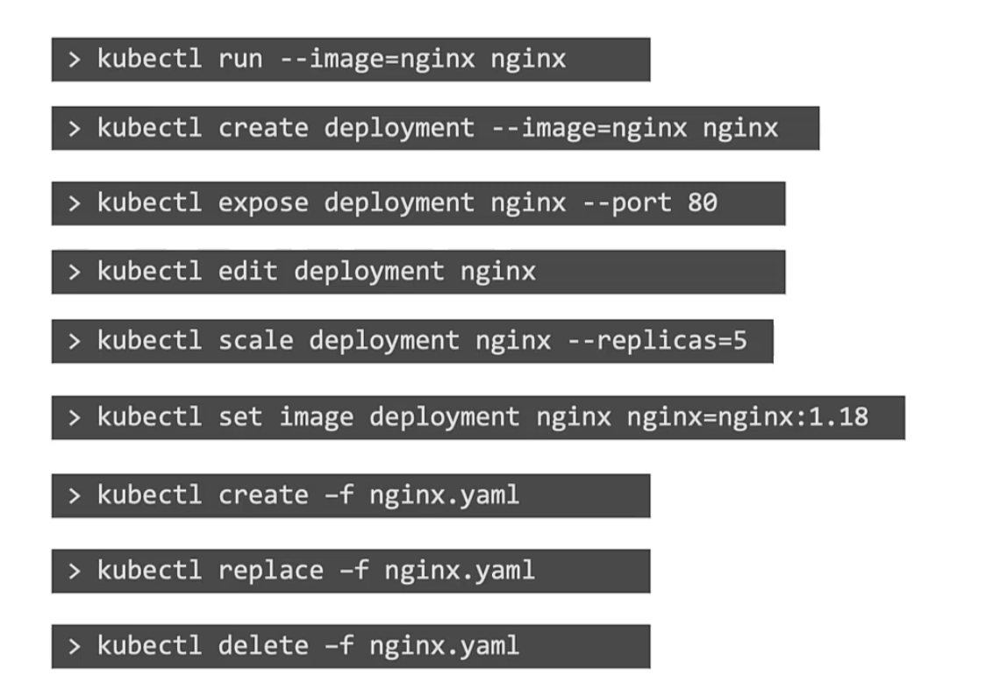

To setup a namespace , not having to use --namespace flag
```
kubectl config set-context $(kubectl config current-context) --namespace dev
```

To view resources from all ns
```
k get pods -A
```




# POD
```
k run nginx --image=nginx
k run nginx --image=nginx --dry-run=client -o yaml > file.yaml

```

# Deployment

```
k create deployment --image nginx nginx 
k create deployment --image=nginx nginx --dry-run=client -o yaml
k create deployment --image nginx nginx --replicas = 4
k scale deployment nginx --replicas=4
```

# Service

```
<This will automatically take pod labels as selectors>
k expose pod redis --port=6978 --name=redis_service --dry-run=client -o yaml
k expose pod redis --type=NodePort --port=80 --name=redis_service --dry-run=client -o yaml
```

```
<This will not use the pods labels as selectors, instead, it will assume selectors as app=redis> 
k create service clusterip redis --tcp=8080:8080 --dry-run=client -o yaml
```

