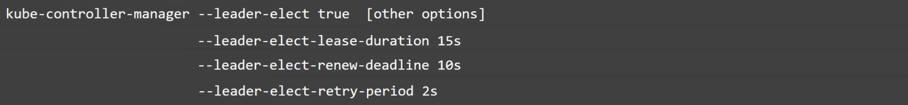
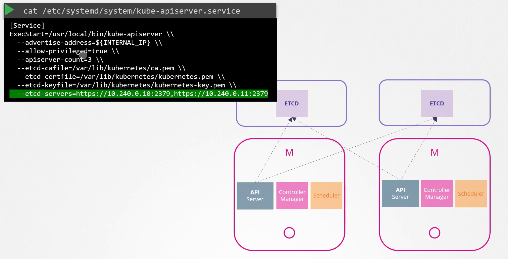

# Hosting Production Applications
A High Availablity Multinode cluster with multiple master nodes

Create more than one master node to avoid single point of failure, as it hosts the control-plane.

API Server can be running in an Active-Active mode.

Now with more than 1 Master , where do you point kubectl to?
- Now send the req to either one of them , not both. Use any loadbalancer on top.

Now scheduler and controller-manager ,can not run together on more than 1 master, so they run in Active-standby mode which is passive.

- How to decide which one is active , which one is passive? through a leader election.

When controller manager is configured , you may specify ```leader-elect``` option
```kube-controller-manager --leader-elect true```

It tries to gain a lock/lease on ```kube-controller-manager endpoint``` object on k8s, which ever process gains lease and becomes active , other becomes passive.
That process remains leader until ```--leader-elect-lease-duration```




## ETCD
Stacked Topology - Etcd is part of k8s control plane node
External etcd topolgy - Etcd is sperated from control plane nodes

Make sure API Server is pointing to right Etcd Server.


### Etcd in high availability

If 2 write requests go to different etcd servers?
ETCD only has 1 write server , and other nodes are followers (Read only).

ETCD implements Leader Election using RAFT Consensus.
Consider a 3 node setup. 
RAFT Algorithm , winning node assumes the leader role , and sends out notification to other nodes while it continues to remain the leader , when it stops or crashed and does not notify other nodes , a re-election is performed and leader is selected again.

Having odd number of nodes is preferred over latest.

Number of nodes can be 3, 5, 7 ...
Fault tolerance can be 1, 2, 3 ...