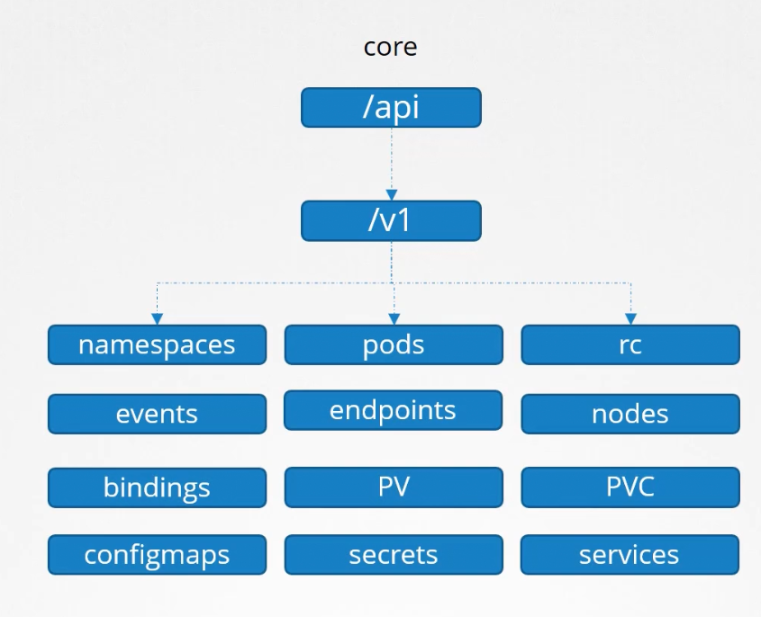
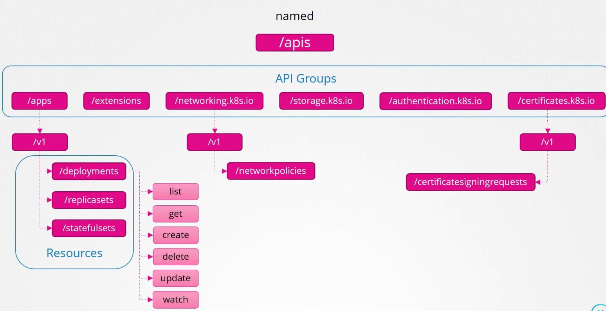

Kubernetes APIs are grouped based on purpose
 
| /metrics | /healthz | /version | /api | /apis | /logs |

APIs reponsible for the cluster functionality

* /api - Core group - All core functionality exists here


* /apis - Named group apis - all features added going to be added here 
> all api groups are versioned , which consist of resource groups 

> all resources from resource groups have actions on them (verbs)



> You will not be allowed to access all API resources via curl or other http client, without authentication , i.e. you'd need to pass your certificate files

Alternatively , you can use ```kubectl proxy```

It will use credentials from your kubeconfig file to access cluster.

> Make a note kube proxy != kubectl proxy


 