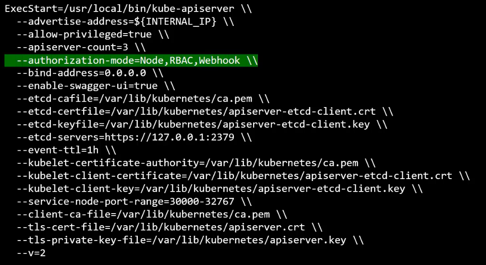

Different kinds of authorizations

1. Node 
2. Attribute Based - ABAC
3. Rolebased - RBAC
4. Webhook

> Node Authorizer

Kubelet should be part of group ```system:node``` group when generating certificate so user name looking like ```system:node:node01``` 

> ABAC 

Each user is associated with certain permissions via a policy file , to modify any permissions , you need to restart the kube-api after modifying policy.

> RBAC
Appropriate roles are created with right permissions 
Users of related tasks are clubbed into groups
Roles are assigned to groups
Just modify role and permissions will update

> Webhook
If all auth needs to be outsourced.

> AlwaysAllow
Regardless of authorization

> AlwaysDeny
Regardless of authorization

These auth modes are set at the time of starting kube-apiserver



Request is authorized in order of all --authorization-mode provided.

# RBAC

Create a role-definition file , and create a role object using that

```
apiVersion: rbac.authorization.k8s.io/v1
kind: Role
metadata:
    name: developer
rules:
- apiGroups: [""]
  resources: ["pods"]
  verbs: ["list", "get", "create", "update", "delete"]
- apiGroups: [""]
  resouces: ["ConfigMap"]
  verbs: ["Create"]
```

Now link user to this role

```
apiVersion: rbac.authorization.k8s.io/v1
kind: RoleBinding
metadata:
    name: devuser-developer-binding
    namespace: dev
subjects:
- kind: User
  name: dev-user
  apiGroup: rbac.authorization.k8s.io
roleRef:
  kind: Role
  name: developer
  apiGroup: rbac.authorization.k8s.io
```

To check access for a certain action
```kubectl auth can-i create deployment```
```kubectl auth can-i delete nodes```
```kubectl auth can-i create deployment --as devuser```
```kubectl auth can-i create pods --as devuser```