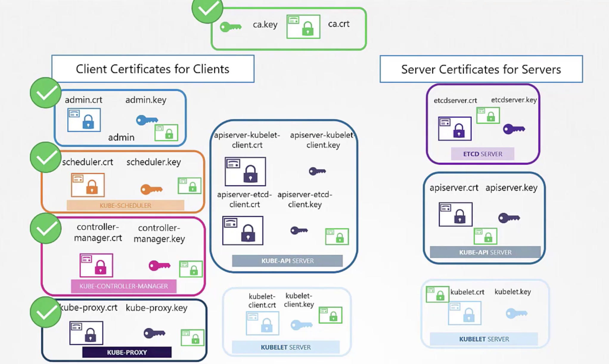

# Creating Server certificates

Generate Key
```openssl genrsa -o ca.key 2048```
ca.key

Gnerate Signing Certificate Signing Request (CSR)
CN = Common Name
```openssl req -new -key ca.key -subj "/CN=KUBERNETES-CA" -out ca.csr```
ca.csr

Signing the certificate
```openssl X509 -req -in ca.csr -signkey ca.key -out ca.crt```
ca.crt

# Generating Client Certificates

Generate Key
```openssl genrsa -o admin.key 2048```
admin.key


Generate CSR
O=system:masters [This user exists on k8s with admin privileges]
```
openssl req -new -key admin.key -subj \
 "/CN=Kube-admin/O=system:masters" -out admin.csr
```
admin.csr

Sign Certificate
```openssl x509 -req -n admin.csr -signkey admin.key -out admin.crt```


Similarly Generate Certificates for other K8s components

While generating CSR , its name must be prefixed with the systen
* kube scheduler :  "/CN=System:Kube-scheduler/O=system:masters" -out schduler.csr

* kube Controller Manager

* Kube Proxy

So far we have generated the certificates as follows
1. admin.crt / admin.key
2. scheduler.crt / scheduler.key
3. controller-manager.crt / controller-manager.key
4. kube-proxy.crt / kube-proxy.key
5. kube-api


To use this certificates 
you can hit kube-api server as follows
```
curl https://kube-apiserver:6443/api/v1/pods \
--key admin.key --cert admin.crt --cacer ca.crt
```

Or use this in config file
```
apiVersion: v1
clusters:
- cluster:
    certificate-authority: ca.crt
    server: https://kube-apiserver:6443
  name: kubernetes
kind: Config
users:
- name: kubernetes-admin
  user:
    client-certificate: admin.crt
    client-key: admin.key
```

You will also need to distribute ca.crt to all components to ensure ca authority is presented



## Server side certificates
1. ETCD Server ```etcd-server```
if there are multiple etcd servers , additional peer certificates are required to created on each etcd node


Specify all these peer certs while starting etcd server


Now Kube-api server
2. Kube-api server ```KUBE-API SERVER```
Kube API Server needs to have more than 1 common name as its referenced by multiple names

```openssl genrsa -out apiserver.key 2048```

```openssl req -new -key apiserver.key -subj\
"/CN=kube-apiserver" -out apiserver.csr -config openssl.cnf
```
apiserver.csr

Now add all the Subject Alternative Names into the CSR

openssl.cnf
```
[req]
req_extensions = v3_req
distinguished_name = req_distinguished_name
[v3_req]
basicConstraints = CA:FALSE
keyUsage = nonRepudiation,
subjectAltName = @alt_names
[alt_names]
DNS.1 = kubernetes
DNS.2 = kubernetes.default
DNS.3 = kubernetes.default.svc
DNS.4 = kubernetes.default.svc.cluster.local
IP.1 = 10.96.0.1
IP.2 = 172.78.12.12
```

Now pass this -config openssl.cnf while generating your certificate
```openssl x509 -req -in apiserver.csr \
 -CA ca.crt \
 -CAKey ca.key \ 
 -CAcreateserial \ 
 -out apiserver.cr
 -extensions v3_req - extfile openssl.cnf -days
```
apiserver.crt


Where to specify these keys 


3. Kubelet server

Each kubelet will have a key/cert pair
they will be named after their node name (not kubelet)

Put entry to use all these certs while starting kubelet in kubelet-config.yaml
```
kind: KubeletConfiguration
apiVersion: kubelet.config.k8s.io/v1beta1
authentication:
    x509:
        clientCAFile: "/var/lib/kubernetes/ca.pem"
authorization:
    mode: Webhook
clusterDomain: "cluster.local"
clusterDNS:
    - "10.32.0.10"
podCIDR: "${POD_CIDR}"
resolvconf: "/run/systemd/resolve/resolv.conf"
runtimeRequestTimeout: "15m"
tlsCertFile: "/var/lib/kubelet/kubelet-node01.crt"
tlsPrivateKeyFile: "/var/lib/kubelet/kubelet-node01.key"
```
The name of nodes in cert will have to prefixed with system, eg: ```system:node:node01```