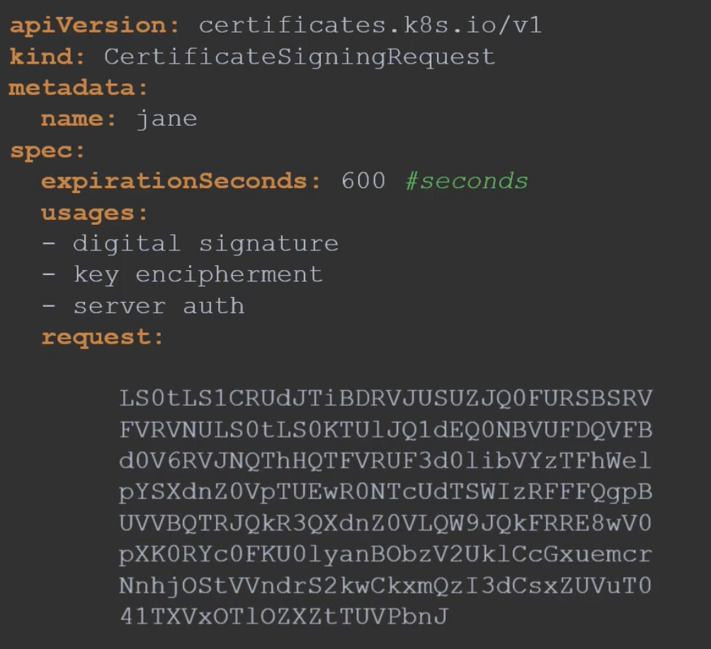
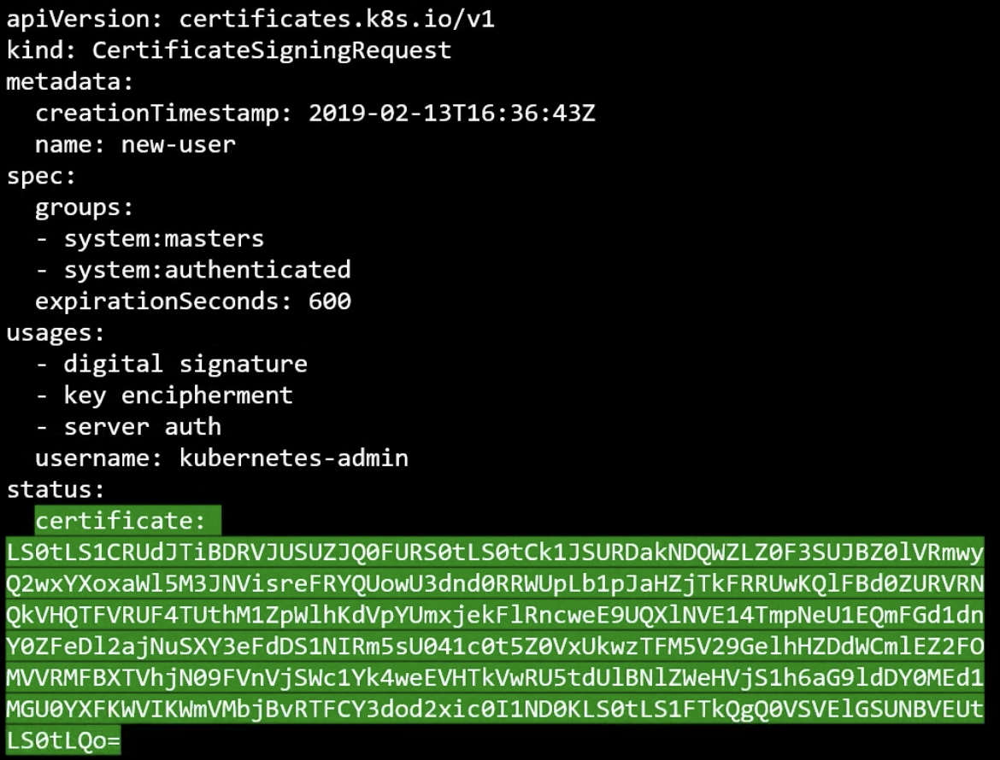

If a new admin joins a team , how to give them their private keys to authenticate to cluster?

New person will create their own key pair , generates a CSR, and sends that to the admin.

The CSR will be then sent to CA server , and signed certificate is returned to the the new person , making them legitimate admin.

Since , a certificate has a validity you need to sign certificates repeatedly.

The certificate is signed by master node - using its private key - making it a CA Authority, its private keys need to be protected and can not be compromised.

Kubeadm does the same thing. 

Kubernetes has a built-in APO that can do this.

Submit a CSR to k8s through an API call.
* API Object - CertificateSigningRequest
All certificate signing requests can be ```reviewed``` and ```approved``` by the admins

Steps for a user 
1. Create a key ```openssl genrsa -out john.key 2048
2. Generate a CSR ```openssl req -new john.key -subj "/CN=john" -out john.csr
3. Base64 contents of this key ```cat john.csr| base64``` and put it in k8s manifest
4. Prepare manifest and put the base64 key-content in request.
    ```
    apiVersion: certificates.k8s.io/v1
    kind: CertificateSigningRequest
    metadata:
        name: john
    spec:
        expirationSeconds: 600
        usage:
        - digital signature
        - key encipherment
        - server auth
        request:
            <encoded text>
    ```
    
5. All certificate signing requests can be seen by admins ```kubectl get csr```
6. CSR Requests can be approved by the admin ```kubectl certificate approve john```
7. K8s will sign the certificate using CA Key-Pair and then this certificate can be shared with user ```kubectl get csr jane -o yaml``` and base64 decode this certificate
