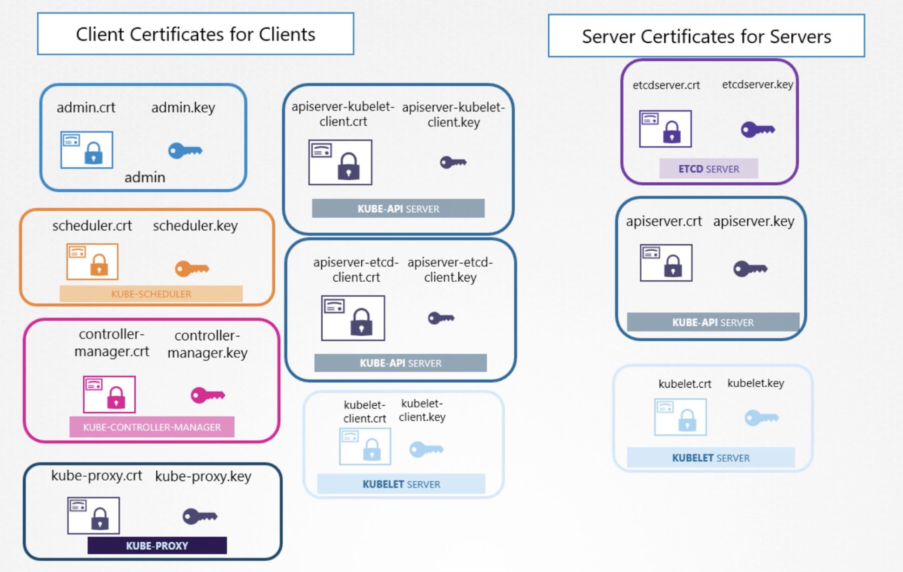

Types of Certificates 

* Root Certificate - Certificates that CA Distributes - The public key of a Certificate Authority called ```Root Certificates```
* Server Certificates - Installed on server 
* Client Certificates 

Naming Convention
-- Any cert with public keys -  .crt or .pem 
-- Any cert with private keys - .key or abc-key.pem

Communication with all components within k8s cluster needs to be secured via keys too.

Identifying various clients and servers in k8s

## Server components
* Kube-api-server [apiserver.crt, apiserver.key] 
* etcd-server [etcdserver.crt, etcdserver.key]
* kubelet-server [kubelet.crt, kubelet.key]

## Client components
* admin [admin.crt, admin.key]
* kube scheduler [scheduler.crt, scheduler.key]
* kube controller manager [controller-manager.crt, controller-manager.key]
* kube proxy [kube-proxy.crt, kube-proxy.key]


