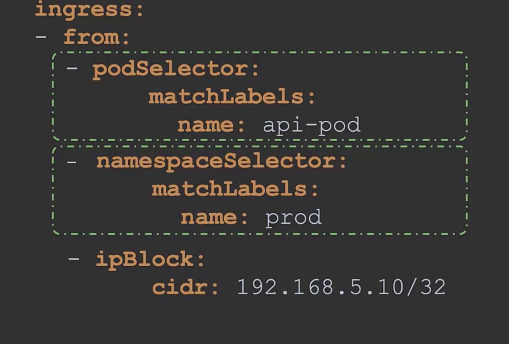
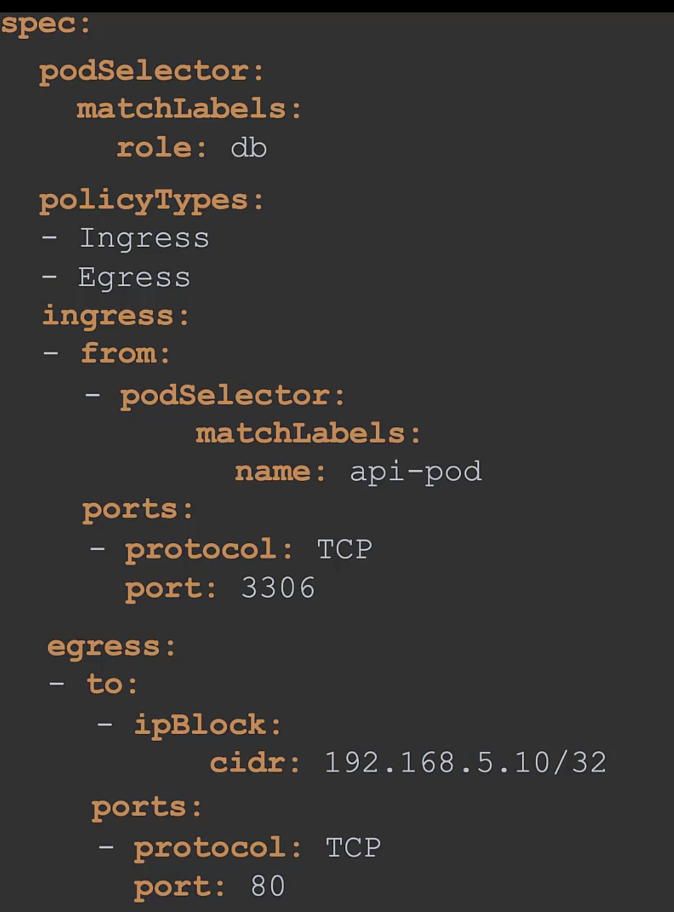

```
apiVersion: networking.k8s.io/v1
kind: NetworkPolicy
metadata:
    name: db-policy
spec:
    podSelector:
        matchLabels:
            role: db
    policyType:
    - Ingress
    ingress:
    - from:
        - podSelector:
            matchLabels:
                role: db
        ports:
        - protocol: TCP
          port: 3306
```
Here all egress traffic will remain unaffected.

Network policies are enforced by CNI 
* Flannel Does not support network policies
* Kube-router
* Calico
* Romana
* Weave-net


Block all traffic in and out of database pod
* If you allow incoming traffic to a pod , response is allowed automatically, but the pod wont be able to generate any egress traffic to this pod.


```
apiVersion: networking.k8s.io/v1
kind: NetworkingPolicy
metadata:
    name: db-policy
spec:
    podSelector:
        matchLabels:
            role: db
    policyType:
    - Ingress
    ingress:
    - from:
        - podSelector:
            matchLabels:
                name: api-pod
          namespaceSelector:
            matchLabels:
                name: prod
        - ipBlock:
            cidr: 192.169.8.2/24
        ports:
        - protocol: TCP
          port: 3306
        
```

If there's no ```namespaceSelector``` all pods matching label across all namespace will match

If there's no podSelector only namepspaceSelector, all pods in matched namespace will be selected

If traffic is coming from outside cluster , we can set ingress and egress rules from certain IP Addresses.

Both rules work as a ```or```



Both rules work as ```and```

Ingress and Egress rule
