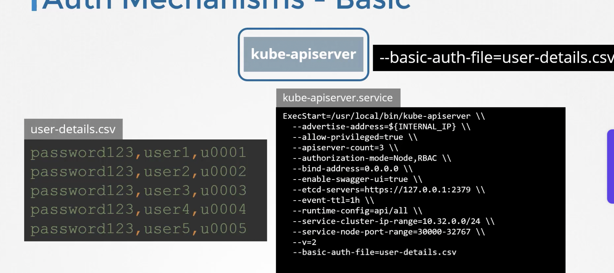

By default all pods can talk to each other, if needs to be restricted , use Network Policies

One would like to access a k8s cluster for admin tasks or a service-account/bot for integration tasks.

Kubernetes has concept of service-account instead of users.
All User access is managed by kube-api server. 
Kube-api authenticates the requests before processing it.
 
How does this auth work?
1. Static file with passwords

```when starting kube-api-server , pass --basic-auth-file=user.file in service file or kube-adm 

2. Static file of tokens
You can also have a static token file, ```--token-auth-file=user-token-details.csv```

3. A 3rd party IAM Service / Ldap
4. Certificates