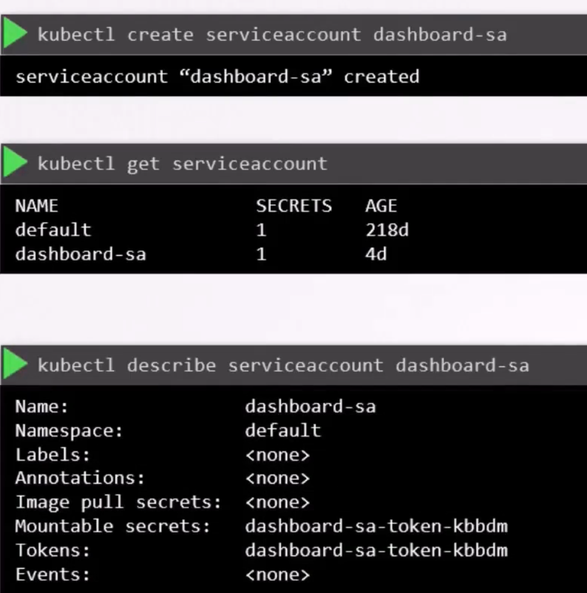
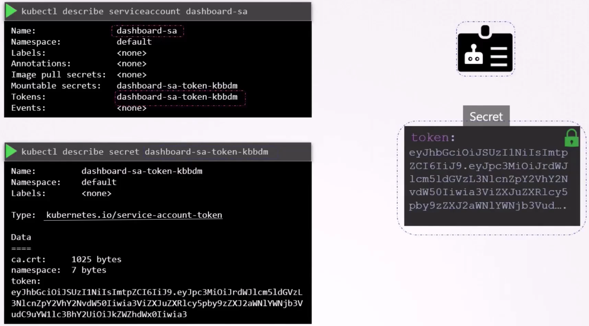
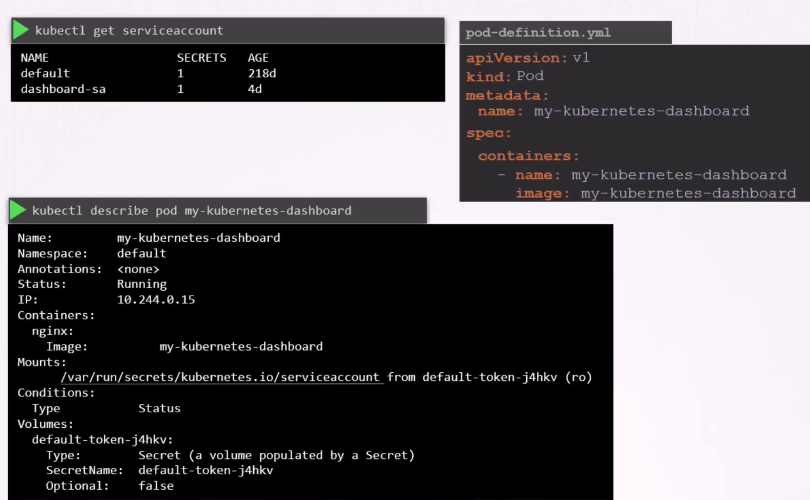
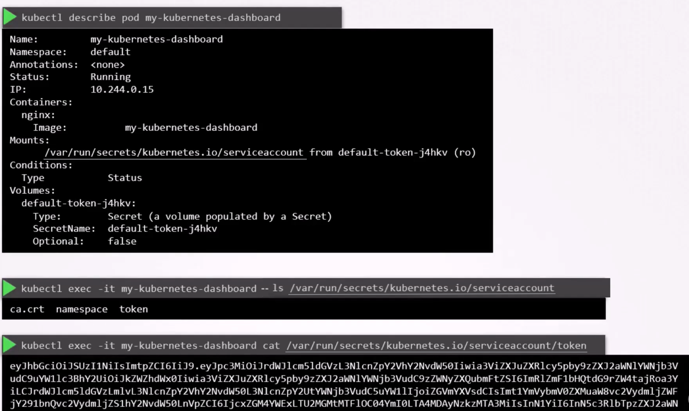
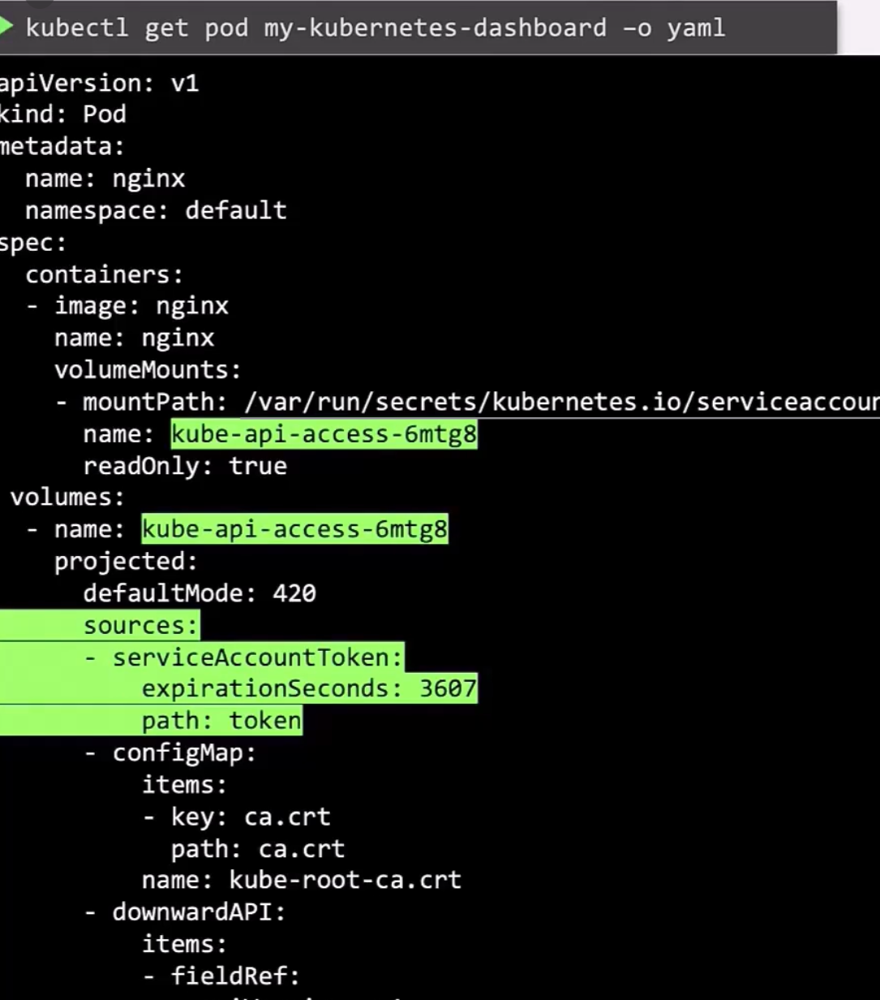

There are 2 types of accounts in k8s
- User account
- Service account

```
kubectl create serviceaccount dashboard-sa
```

```
kubectl get serviceaccount
```

When a service account is created a SA Token is created automatically
```
kubectl describe serviceaccount  <SA Name>
```


The associated token of service-account is stored in a secret object , this token can be used as a bearer token in the call to k8s API



```
curl https://<cluster:port>/api -insecure --header "Authorization: Bearer eyJh*****" 
```

* For every namespace a default SA is created 
* if your application is hosted in kubernetes , you can use the mount the volume of SA , and give application of those credentials 

By Default , this default service-account token is mounted to pod volume


This default-sa token is used to access kubernetes API


If your pod needs to have a service-account token access , add it in pod definition
```
apiVersion: v1
kind: Pod
metadata:
    name: my-kubernetes-dashboard
spec:
    containers:
    - name: my-kubernetes-dashboard
      imgae: my-kubernetes-dashboard
    serviceaccountName: dashboard-sa
```

You can not reload any modifications in service-account into a running pod, you must recreate pod for this.

If you are managing a pod via deployment , then you dont need to cause modifying deployment will trigger rollout of new pods

## Service Account updates
* SA Tokens earlier did not have any expiration
* TokenRequestAPI was introduced 
 - These tokens are audience bound
 - Time bound
 - Object bound
 as a result more secure
 these tokens are mounted as projected volumes with expiration


New pods no longer rely on this secret token, instead a token with set lifetime are created , mounted as a projected volume.


1.24 onwards
A service account no longer automatically creates an access token secret. But do it manually
```
kubectl create serviceaccount dashboard-sa
kubectl create token dashboard-sa
```
This token comes with a lifetime of 1 hour since the time of creation and can be increased. 


