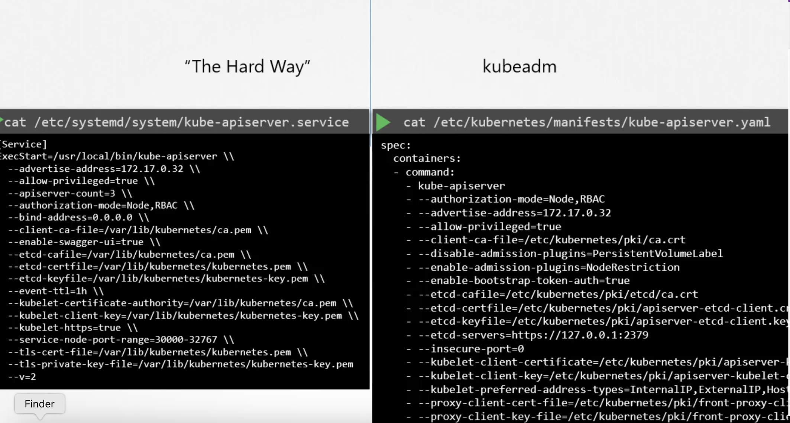
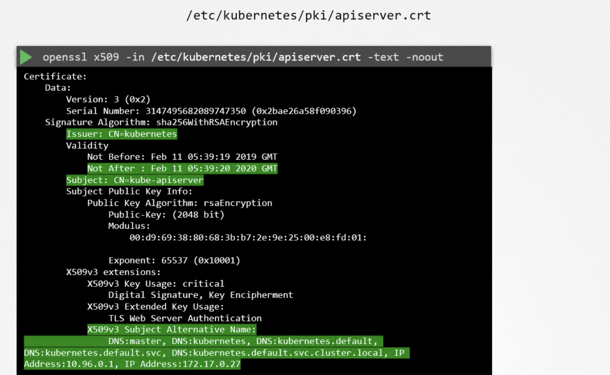
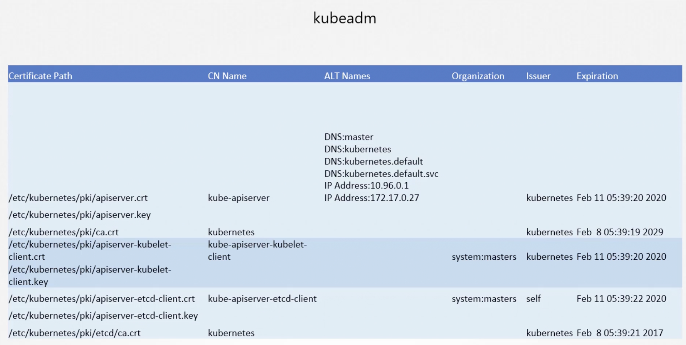
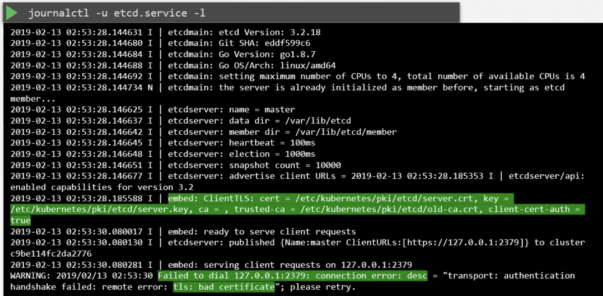
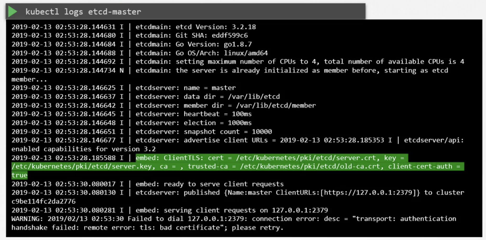

If you deploy a kubecluster via kubeadm , it manages generating certificates for you

If kubeadm was not used 
```cat /etc/systemd/system/kube-apiserver.service```

if cluster was deployed via kubeadm
```cat /etc/kubernetes/manifests/kube-apiserver.yaml```



Debugging issues with certificates .

Find a list of all certificates used in the server 
open each and check content
```openssl X509 -in /etc/kubernetes/pki/apiserver.crt -text -noout```
Check Subject
Check SAN
Check issuer
Check Validity




If cluster is being setup from scratch - explore logs via journalctl
```journalctl -u etcd.service -l```



If cluster is setup via kubeadm , use logs the pod


If a core component like etcd or kube-apiserver is down, kubectl wont function.
Then use docker to fetch logs
