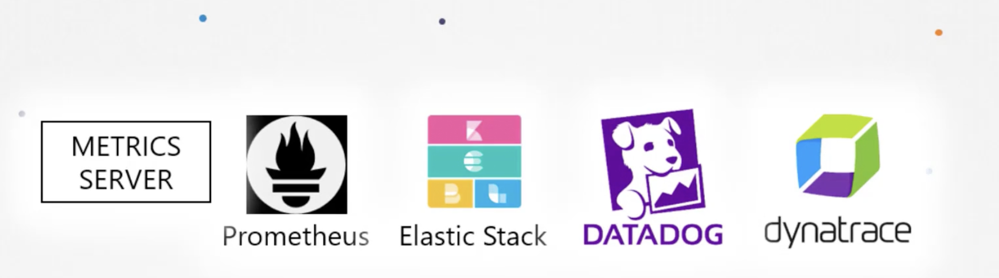

# Monitoring

1. What would you like to monitor?

Healthy Nodes, CPU , Memory, Pod Metrics(CPU/Mem) consumption

2. Different Monitoring solutions



Kubelet component [CAdvisor] sends performance metrics to kubelet API and exposing it to Metrics Server

```minikube addons enable metrics-server```

or install all components by k create ....

Once you start sending metrics to metrics server , you can view them by ```kubectl top node``` or ```kubectl top pod```

