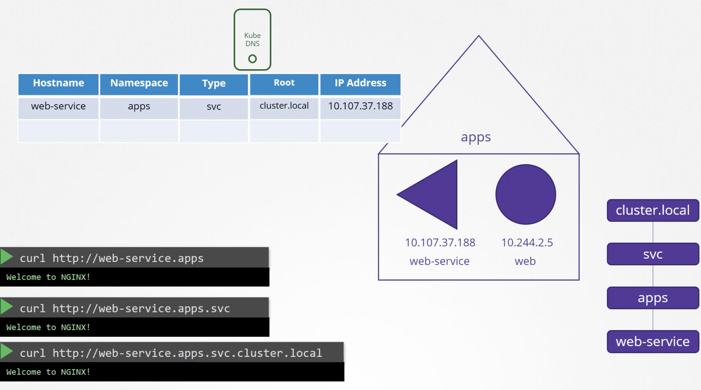
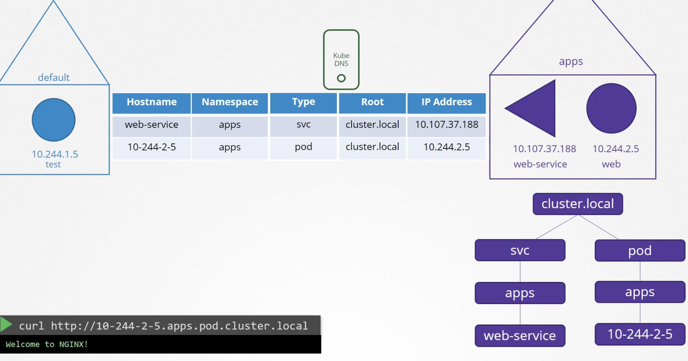
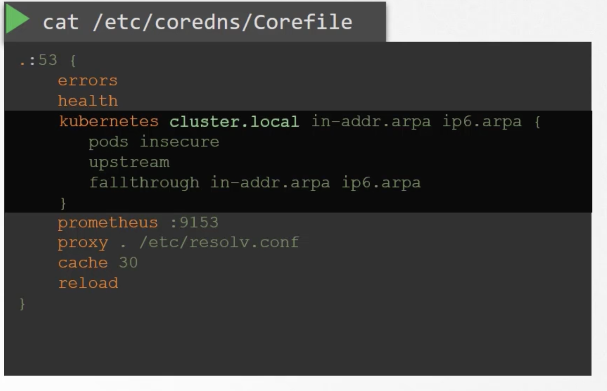
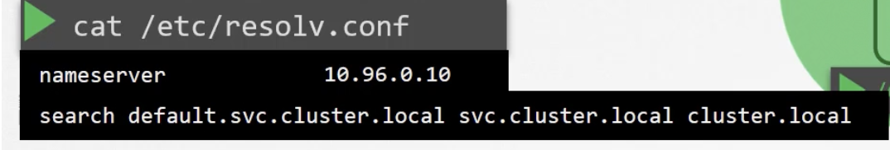

# DNS

Whenever a service is created , k8s DNS Service creates a DNS record mapping k8s service-name to IP so now any pod can reach this service using its name. 



Records for pods are not created by default, if enabled it looks like


## CORE DNS
Its deployed as a Pod  [Replica-sets within a deployment] which runs core-dns executable.

CoreDNS has a configuration file ```cat /etc/coredns/Corefile``` has number of plugins configured.



Pods option is responsible for adding pod ip(hypenated) as a DNS record 
Any record DNS record thats not resolve-able by this DNS Server , forwarded to nameserver specified in ```/etc/resolve.conf```


This Corefile is passed into pod as a configMap Object.

How do pods point to DNS Server.
When we deploy coredns , it creates a service ```kube-dns``` IP Address of this service is configured as Nameserver in ```/etc/resolve.conf``` of the pods by kubelet at the time of pod creation

