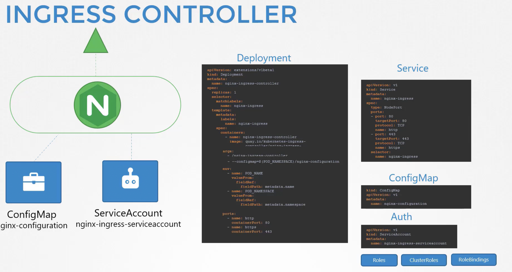
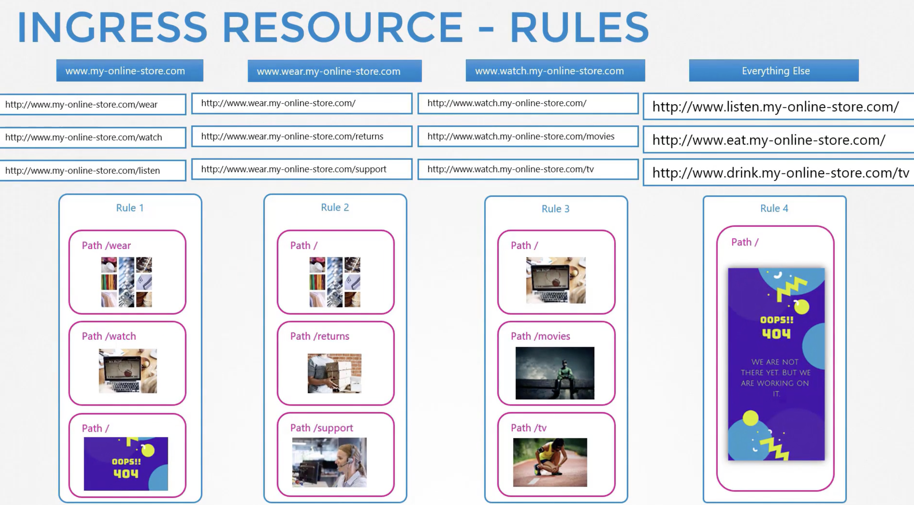
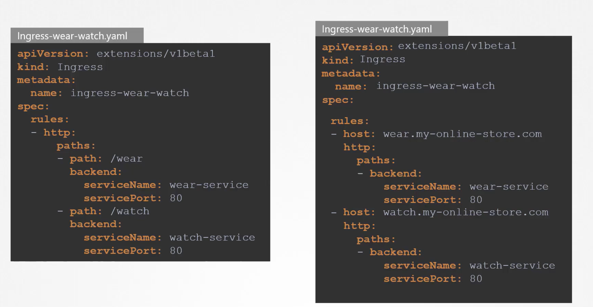

# Ingress

It helps user access your application  via a single externally available URL that can be configured to route traffic to pods based on URL Path and maintains SSL Security as well.1


Layer 7 LB that can be configured using native k8s primitives.

1. Ingress Controller 
    It is not present on k8s by default.
    - Nginx
    - HAProxy
    - Contour
    - HAProxy
    - traefik
    - Istio
    - GCE

    eg: nginx
    
2. Ingress Resources
    Its set of rules and configuration applied to controller 
    - forward all incoming traffic to a single applications or 
    - route to different apps based on URL path.
    - route based on FQDN

    Its created with a k8s definition file ```ingress-wear.yaml``` 
    ```
    apiVersion: extensions/v1beta1
    kind: Ingress
    metadata: 
        name: ingress-wear
    spec:
        backend:
        serviceName: <>
        servicePort: <>
    ```

    and create this ingress resouce
    

    definition file looks like
    