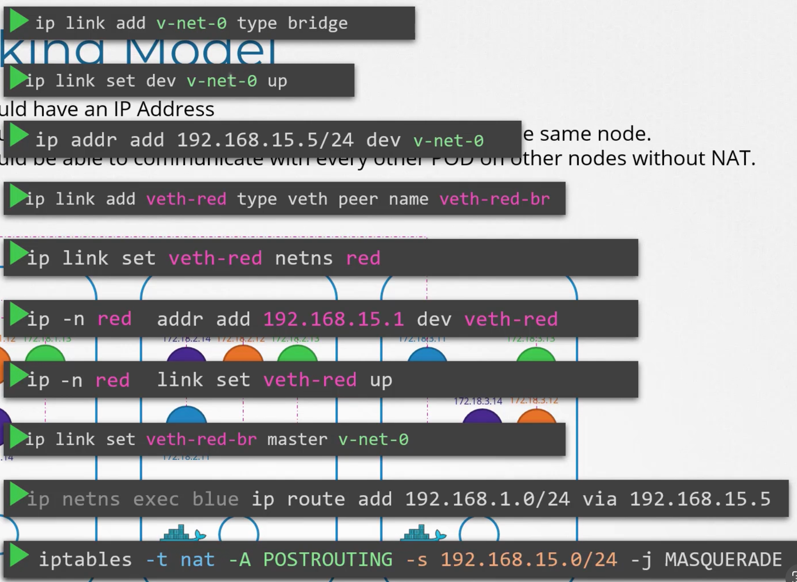

How does kubernetes work?

1. Create a network namespace
2. Create a Bridge Network/Interface
3. Create VETH Pairs (Pipe, Vitual Cable)
4. Attach vEth to Namespace
5. Attach other vEth to Bridge
6. Assign IP Address
7. Bring interfaces up
8. Enable NAT - IP Masquerade



CNI defines a set of responsibilities for container runtime

1. CNI must create network ns 
2. Identify network container must attach to
3. Container Runtime to invoke network plugin(bridge) when container is added (ADD)
4. Container Runtime to invoke network plugin(bridge) when container is removed (DEL)
5. Json format of this network configuration

Plugins must
1. The plugin should support ADD/DEL/CHECK  command line args 
2. Must support parameters like container id, network ns, etc
3. Must manage IP Assignments to Pods
4. Must return results in a specific format

As long as container runtime and plugins adhere to these standards.
Any runtime should be able to run with any plugin

Some CNI plugins are 
- Weave
- Flannel
- Cillium
- NSX
- Calico

* Docker does not adhere to CNI
hence these plugins dont work with docker


Common commands

```
ip link

ip addr

ip addr add <cidr> <name> <eth>

ip route

ip route add <cidr> via <ip>

cat /proc/sys/net/ipv4/ip_forward

arp

netstat -plnt  #Shows which program is running on which port
netstat -nplt
Active Internet connections (only servers)
Proto Recv-Q Send-Q Local Address           Foreign Address         State       PID/Program name    
tcp        0      0 127.0.0.11:38887        0.0.0.0:*               LISTEN      -                   
tcp        0      0 127.0.0.1:10248         0.0.0.0:*               LISTEN      4350/kubelet        
tcp        0      0 127.0.0.1:10249         0.0.0.0:*               LISTEN      4962/kube-proxy     
tcp        0      0 192.38.1.3:2379         0.0.0.0:*               LISTEN      3778/etcd           
tcp        0      0 127.0.0.1:2379          0.0.0.0:*               LISTEN      3778/etcd           
tcp        0      0 127.0.0.1:32811         0.0.0.0:*               LISTEN      1342/containerd     
tcp        0      0 192.38.1.3:2380         0.0.0.0:*               LISTEN      3778/etcd           
tcp        0      0 127.0.0.1:2381          0.0.0.0:*               LISTEN      3778/etcd           
tcp        0      0 0.0.0.0:8080            0.0.0.0:*               LISTEN      1328/ttyd           
tcp        0      0 127.0.0.1:10257         0.0.0.0:*               LISTEN      3753/kube-controlle 
tcp        0      0 127.0.0.1:10259         0.0.0.0:*               LISTEN      3754/kube-scheduler 
tcp        0      0 127.0.0.53:53           0.0.0.0:*               LISTEN      608/systemd-resolve 
tcp        0      0 0.0.0.0:22              0.0.0.0:*               LISTEN      1343/sshd: /usr/sbi 
tcp6       0      0 :::10250                :::*                    LISTEN      4350/kubelet        
tcp6       0      0 :::6443                 :::*                    LISTEN      3779/kube-apiserver 
tcp6       0      0 :::10256                :::*                    LISTEN      4962/kube-proxy     
tcp6       0      0 :::22                   :::*                    LISTEN      1343/sshd: /usr/sbi 
tcp6       0      0 :::8888                 :::*                    LISTEN      4611/kubectl   


route
```

To find network interface configured for cluster connectivity on controlplane node
```
find ip add of control plane


k get nodes -o wide | grep controlplane
controlplane   Ready    control-plane   12m   v1.30.0   192.38.1.3    <none>        Ubuntu 22.04.4 LTS   5.4.0-1106-gcp   containerd://1.6.26


find which network interface.
ip a | grep 192.38.1.3
    inet 192.38.1.3/24 brd 192.38.1.255 scope global eth0

eth0
```

To see what is the MAC address on a network interface - 

```
ip link show eth0
11356: eth0@if11357: <BROADCAST,MULTICAST,UP,LOWER_UP> mtu 1450 qdisc noqueue state UP mode DEFAULT group default 
    link/ether 02:42:c0:26:01:03 brd ff:ff:ff:ff:ff:ff link-netnsid 0
```


