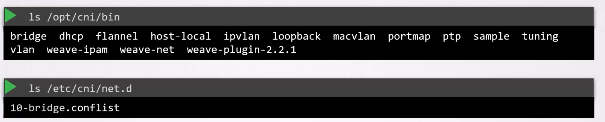
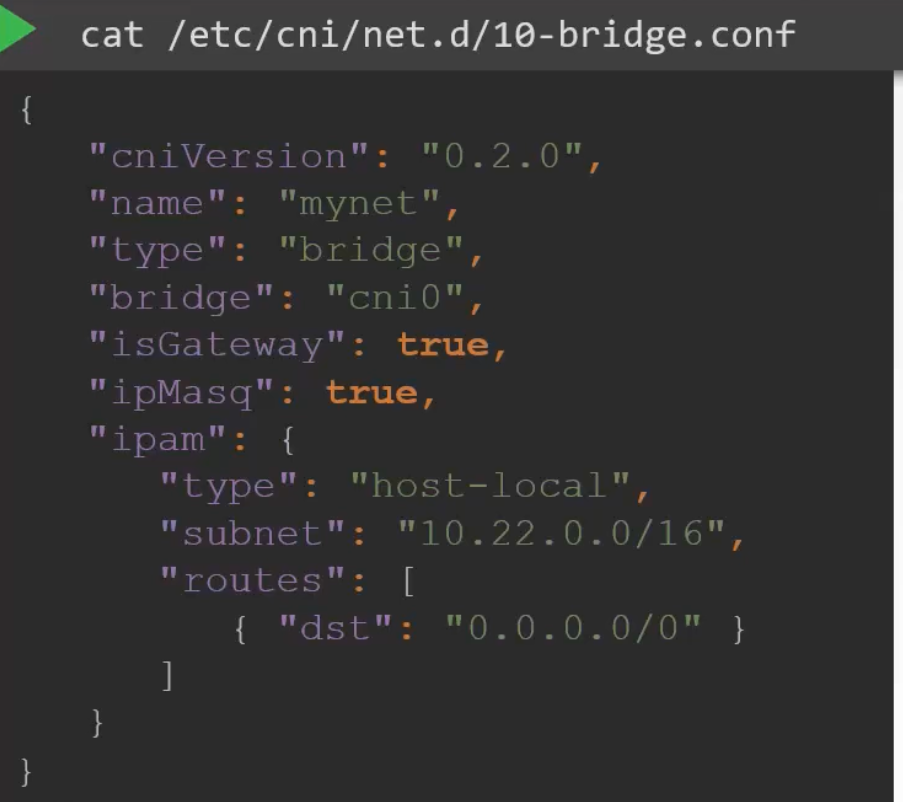

Networking Model

1. Every pod should have an IP Address
2. Every pod should be able to communicate with every other pod in same node
3. Every pod should be able to communicate with every other pod on other nodes without NAT

Eg:

We have a 3 node cluster.

node1 = 192.168.1.11
node2 = 192.168.1.12
node3 = 192.168.1.13

Create a bridge network on each node
```
[node1] ip link add v-net-0 type bridge
[node2] ip link add v-net-0 type bridge
[node3] ip link add v-net-0 type bridge
```

Then bring them up
```
[node1] ip link set dev v-net-0 up
[node2] ip link set dev v-net-0 up
[node3] ip link set dev v-net-0 up
```

Now select a subnet range for each bridge interface
Attach an IP range to this bridge interface

```
[node1] ip addr add 10.244.1.1/24 dev v-net-0
[node2] ip addr add 10.244.2.1/24 dev v-net-0
[node3] ip addr add 10.244.3.1/24 dev v-net-0
```

Now every time a new container is created .
To attach a container to a network , we create a veth pair

```
ip link add ...
```

Attach veth pair one end to container another to bridge

```
ip link set ...
ip link set ...

```
Assign IP Address and add a route to default gateway

```
ip -n <namespace> addr add ...
ip -n <namespace> route add ...
```

Bring up the interface

```
ip -n <namespace> link set
```


### To enable pods to reach pods on other nodes

Add a route in routing table of node 1 for pods in routing table of node 2 via node2's IP Address

```
ip route add 10.244.2.2 via 192.168.1.12
ip route add 10.244.3.2 via 192.168.1.13
```


This will be a lot of configuration on each node , instead use a router to store this routing information.


CNI - tells kubernetes to call a script that does above specified things as soon as a container is created.


Now this CNI Script should offer below commands
1. Add - 
    when a container is created a veth pair is created
    attach veth pair one end to container , another to bridge
    assign IP
    bring up interface
2. DEL -
    Cleanup all interfaces when pod is removed


* The CNI Configuration is passed as a command line argument, to identify script which does this.

Container Runtime  -> /etc/cni/net.d/net-script.confilist -> /opt/cni/bin/net-script.sh -> ./net-script.sh add <container> <namespace>

## COnfiguring CNI

component responsible for invoking CNI is container runtime [containerd or cri-o]

Plugins are stored in , cri finds cni plugin in ```/opt/cni/bin``` and how to use this plugin is specified in  ```/etc/cni/net.d```


in ```/etc/cni/net.d``` plugin finds which bridge config to use , if multiple will choose one in alphabetical order



Example of bridge.conf



isGateway -> Whether or not to assign IP to bridge so it can act as a gateway.
isMasq -> If a NAT Rule should be added for IP Masqaurading
ipam.type: -> If set to host-local IP Addr are managed locally on host, can also be set to a DHCP Server
ipam.subnet -> Range of IP Addresses which can be assigned to pods
ipam.routes.destination ->
