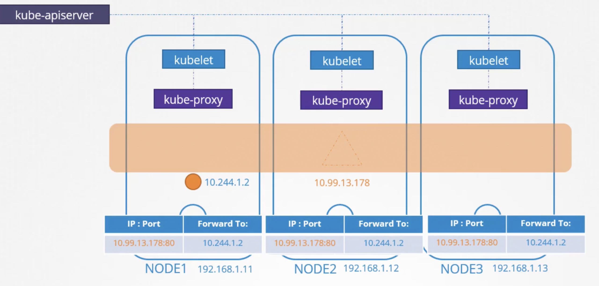
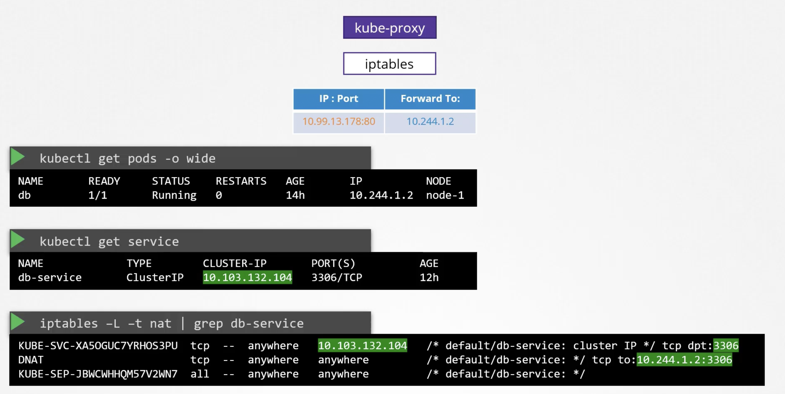
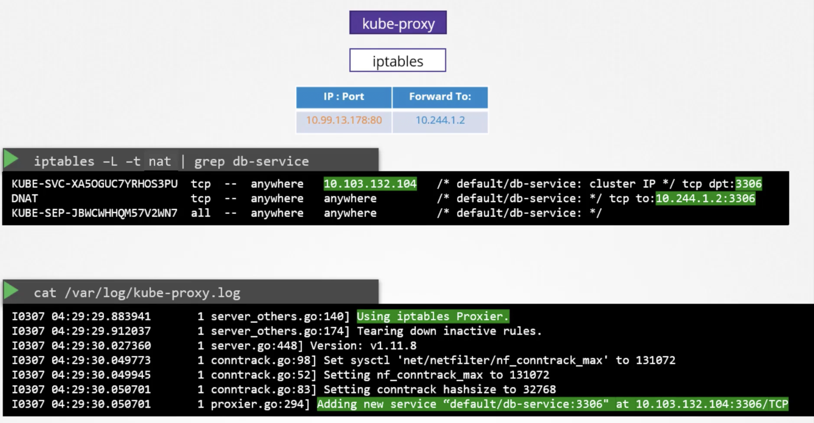

# Service Networking
If you want a pod to access services hosted on another pod , you would always use a service.

When a service is created it is accessible form all parts on cluster , irrespective of nodes the pods are on.

While a pod is hosted on a node , a service is hosted across cluster not bound to any node.

Service is only accessible from within the cluster - This service is known as ```ClusterIP```.


Service is outside cluster on a particular port - ```NodePort``` . Service will expose this port across the cluster-endpoint and service is accessible even outside on the cluster's endpoint/IP over nodePort.

We know that the Kubelet is responsible for creating Pods. Kubelet watches changes in Kube-API Server.
Each time a new pod is to be created , kubelet creates pods and invokes CNI plugin to configure networking for this pod.

Each node also has a component called  ```Kube-proxy``` it watched kube-api server every time a new service needs to be created kube-proxy gets into action.

it creates a cluster-wide object service (not on node)

Services are no processes, not namespaces  or interface for service but just a virtual Object.

When we create a service object in k8s , it is assigned an IP address from a predefined range

Kube-Proxy grabs that IP Address and creates forwarding rules on each node in cluster [Any traffic to IP of service should go to IP of pod] 



Whenever services are created or deleted , Kube-proxy creates or deletes these rules.
 
### How does kube proxy creates / deletes these rules?

Kube-proxy supports different ways to do this , can be set while starting kube-proxy
1. Userspace: 
2. IP Tables
3. IPVS


When kube-api-server is started , you can specify IP Range to be given to services 
```kube-api-server --service-cluster-ip-range``` 
This is different from ```--pod-network-cidr-range``` , this cidr is used for allocating to IPs to pods.
Both of these IP Ranges should not overlap 



Here we can see nat table output
A DNAT Rule is added to IP Table of type NodePort.

We can see this in kube-proxy logs

 
