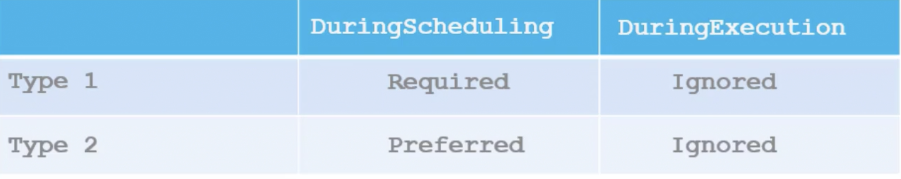

# Node Affinity


```
affinity:
    nodeAffinity:
        requiredDuringSchedulingIgnoredDuringExecution:
            nodeSelectorTerms:
            - matchExpressions:
                - key: size
                  operator: In / NotIn / Exists . . .
                  value: 
                   - Large
```

Different Node Affinities

requiredDuringScheduleIgnoredDuringExecution
preferredDuringScheduleIgnoredDuringExecution


requiredDuringScheduleRequiredDuringExecution
preferredDuringScheduleRequiredDuringExecution
