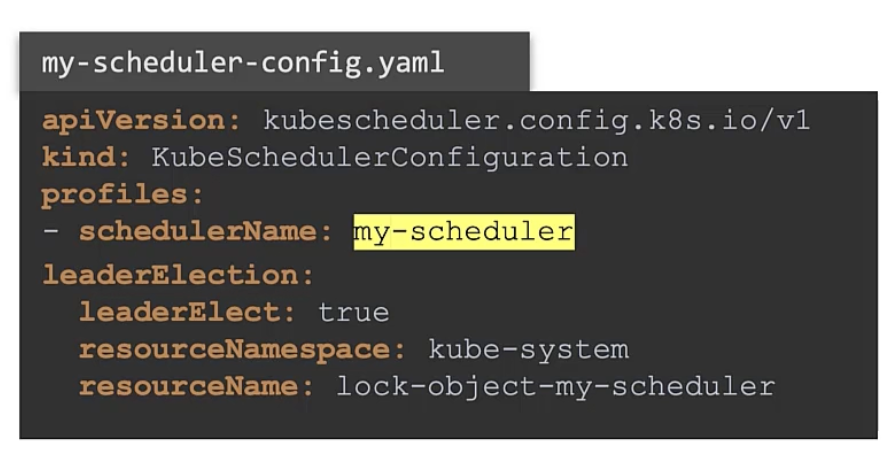
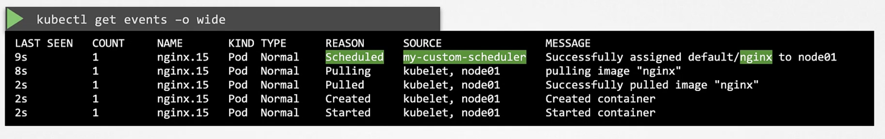
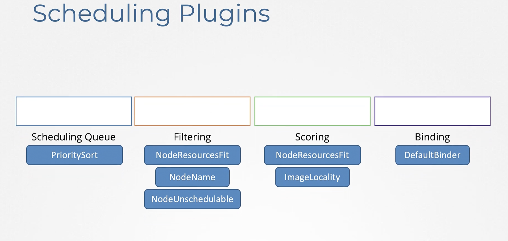
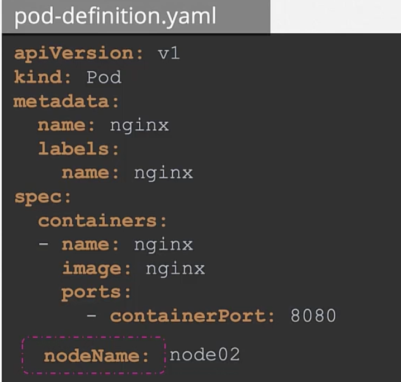
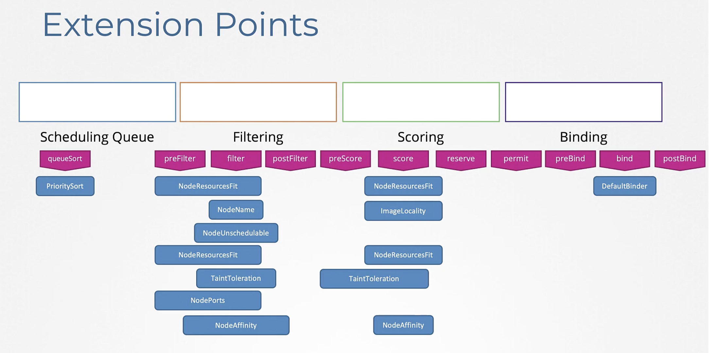

# Scheduler 
K8s scheduler will schedule pod on node by its own scheduling algorithm and taints and tolerations.
Since K8s is highly you can write your own scheduler and run it in k8s.

This was all applications can be scheduled using default scheduler , and applications of your choice may use your custom scheduler ```a k8s cluster can have multiple schulers at once```

This can be done in a kube scheduler config file.

scheduler-config.yaml  ```if you don't specify a name, it is set to default-scheduler```
```
apiVersion: kubescheduler.config.k8s.io/v1
kind: KubeSchedulerConfiguration
profiles:
- schedulerName: default-scheduler

```


```
apiVersion: kubescheduler.config.k8s.io/v1
kind: KubeSchedulerConfiguration
profiles:
- schedulerName: my-scheduler

```

Simplest way of deploying an additional scheduler

Create the binary of the scheduler (you may have generated this) with some more options

```
ExecStart=/usr/local/bin/kube-scheduler \\
    --config=/etc/kubernetes/config/kube-scheduler.yaml
```
```
ExecStart=/usr/local/bin/kube-scheduler \\
    --config=/etc/kubernetes/config/my-scheduler.yaml
```

with kubeadm - deploying scheduler as a pod
my-custom-scheduler.yaml

```
apiVersion: v1
kind: Pod
metadata:
    name: my-custom-scheduler
    namespace: kube-system
spec:
    containers:
    - command:
        - kube-scheduler
        - --address=127.0.0.1
        - --kubeconfig=/etc/kubernetes/scheduler.conf
        - --config=/etc/kubernetes/my-scheduler-config.yaml
    image: k8s,gcr.i/kube-scheduler-amd64:v1.11.3
    name: kube-scheduler
```

Now when you have multiple copies of schedulers running on  your master node ``leaderElect``
When multiple copies of schedulers are running on different master nodes , leaderElect will help in choosing who will lead scheduling activities.




### Using custom scheduler 
When creating a pod definition , put schedulerName property 
```
apiVersion: v1
kind: Pod
metadata:
    name: nginx
spec:
    containers:
    - image: nginx
      name: nginx
    schedulerName: my-custom-scheduler
```


### How to know which scheduler picked up the scheduling of pod?

In current namespace
```kubectl get events -o wide```
 

## Scheduler Profile



```Scheduling Queue ``` as soon as a pod is created to be scheduled, it enters a scheduling queue, waiting to be scheduled based on priority configured on the pod.

```Filtering Queue ``` Nodes that can not pods because of less resource capacity are filtered out.

```Sourcing Phase ``` Nodes are then scored , a node which will have more resources left after scheduling the pod gets a higher score, and one with higher score will be chosen for scheduling.

```Binding Phase ```Node is bound to the score

All these operations are achieved using certain plugin 
Plugins --

NodeName: Specified on which pod to be scheduled


Property of node if no pods should be scheduled on it


ImageLocality
A higher score is given to the node which has an image downloaded already

