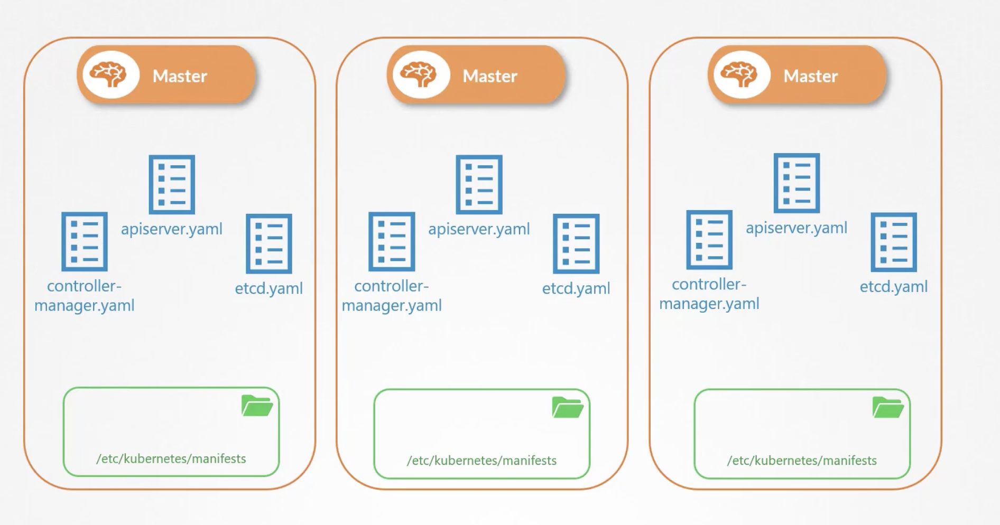
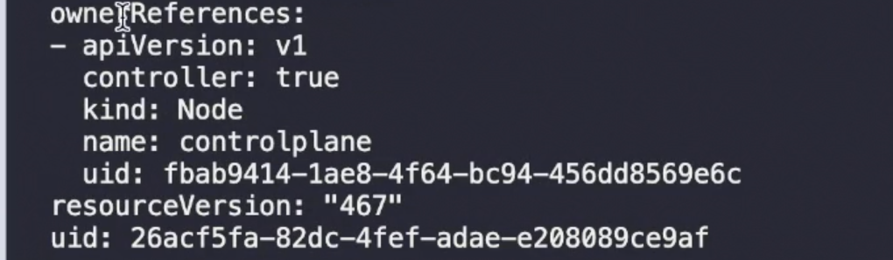
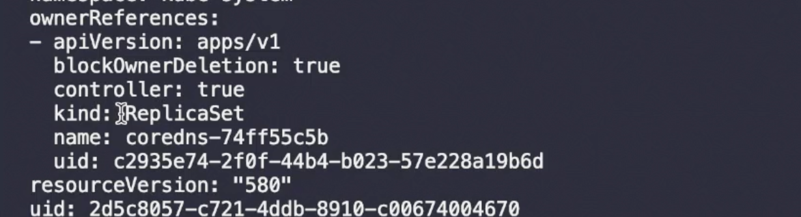

Kubelet gets instruction from kube-api and create pods which are scheduled by kube-scheduler.

If there were no kube-api server ?
Kubelet can be configured to read pod definition file from ```etc/kubernetes/manifests``` if pod dies , kubelet will restart it. 
If file is removed from this directory , pod will be deleted automatically.
 

** Only pods can be created this way , not deployments or replica-sets

This can be configured when starting kubelet.

```
--pod-manifest-path=/etc/Kubernetes/manifests
```

Another way is to use 

kubelet.service
```
--config=kubeconfig.yaml
```
and static pod path ```staticPodPath: /etc/kubernetes/manifests```

1. Check option pod manifest path, 
2. else look for config option
3. Once static pods are created , we can view them using docker ps command, kubectl wont work cause it works with kube-api server.

Kubelet can take in input for creating pods from different ways , 
1. Use static pod path
2. Use HTTP API endpoint, which is used by kubelet , HTTP request is sent via kube-api server
3. Api-server is aware of the static-pods created by kubelet


Static Pods vs Daemon Sets
| Static Pods | Daemon Sets |
| -------- | ------- |
| Created by Kubelet | Created by Kube-api Server |
| Deploy Control Plane as Static pods | Deploy Monitoring and logging agents on node |
| Ignored by Kube-Scheduler |


Static pods to deploy components of control plane.
start by installing kublet on all master nodes, and create pod definitions of control plane components and run them as pods


This is how kubeadm tool setups up clusters 

Kubelet config looks like ```/var/lib/kubelet/config.yaml```

```
cat /var/lib/kubelet/config.yaml 
apiVersion: kubelet.config.k8s.io/v1beta1
authentication:
  anonymous:
    enabled: false
  webhook:
    cacheTTL: 0s
    enabled: true
  x509:
    clientCAFile: /etc/kubernetes/pki/ca.crt
authorization:
  mode: Webhook
  webhook:
    cacheAuthorizedTTL: 0s
    cacheUnauthorizedTTL: 0s
cgroupDriver: systemd
clusterDNS:
- 10.96.0.10
clusterDomain: cluster.local
containerRuntimeEndpoint: ""
cpuManagerReconcilePeriod: 0s
evictionPressureTransitionPeriod: 0s
fileCheckFrequency: 0s
healthzBindAddress: 127.0.0.1
healthzPort: 10248
httpCheckFrequency: 0s
imageMaximumGCAge: 0s
imageMinimumGCAge: 0s
kind: KubeletConfiguration
logging:
  flushFrequency: 0
  options:
    json:
      infoBufferSize: "0"
    text:
      infoBufferSize: "0"
  verbosity: 0
memorySwap: {}
nodeStatusReportFrequency: 0s
nodeStatusUpdateFrequency: 0s
resolvConf: /run/systemd/resolve/resolv.conf
rotateCertificates: true
runtimeRequestTimeout: 0s
shutdownGracePeriod: 0s
shutdownGracePeriodCriticalPods: 0s
staticPodPath: /etc/just-to-mess-with-you
streamingConnectionIdleTimeout: 0s
syncFrequency: 0s
volumeStatsAggPeriod: 0s

```


## To find out how owner of a pod to find out if its a static pod
Describe pod and find owner reference section 


note kind: Node


for a non static pod, owner will be a anything but node

