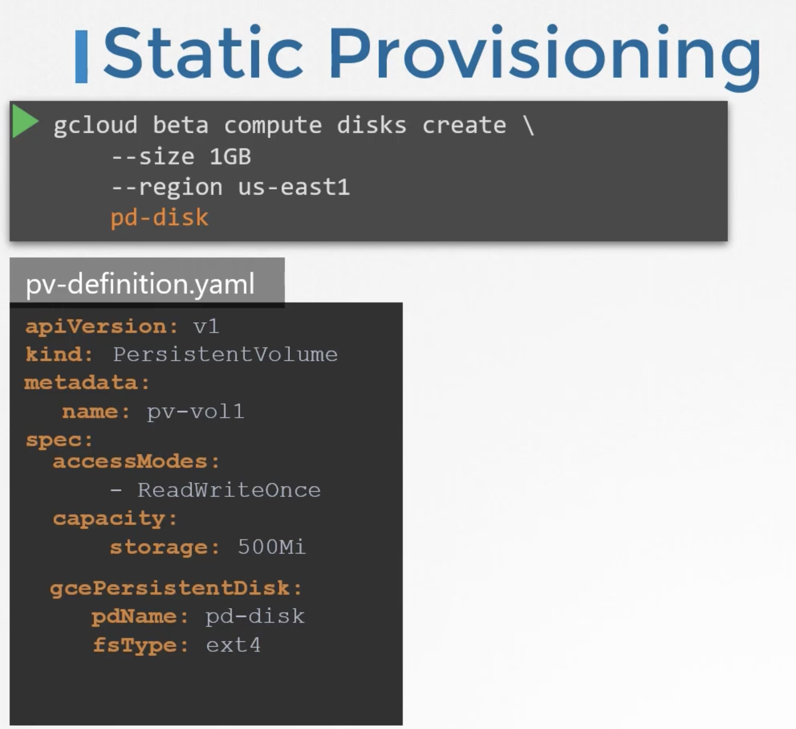

# Container Storage Interface

A defines a set of RPCs that ll be called by container orchestrator , these must be implemented by storage driver.


## Volumes
Docker volumes are meant to be transient.
To persist data , even after pod / container is deleted is achived via volumes.

```
apiVersion: v1
kind: Pod
metadata:
    name: random-number-generator
spec:
    containers:
    - image: alpine
      name: alpine
      command: ["/bin/sh", "-c"]
      args: ["shuf -i 0-100 -n 1 >> /opt/number.out;"]
      volumeMounts:
      - mountPath: /opt
        name: data-volume
    volumes:
    - name: data-volume
    hostPath:
        path: /data
        type: Directory

```


hostPath -> works on single node cluster , it does not work on multi-node cluster
we could configure other volumes such as (aws block storage, NFS) etc which will be 
same across all nodes.

```
volume:
- name: data-volume
  awsElasticBlockStore:
    volumeId: <volid>
    fsType: ext4
```

## Persistent volumes

An administrator creates Persistent Volumes.
A User creates Persistent Volume Claim. 

If no volume is available , PVC remains in pending state.

pvc-definition.yaml
```
apiVersion: v1
kind: PersistentVolumeClaim
metadata:
    name: myClaim
spec:
    accessModes:
        - ReadWriteOnce:
    resources:
        requests:
            storage: 500Mi


apiVersion: v1
kind: PersistentVolume
metadata:
    name: pv-vol
spec:
    accessModes:
        - ReadWriteOnce:
    capacity:
            storage: 1Gi    
    awsElasticBlockStore:
        volumeID: <vol-id>    
        fsType: ext4
```

Since no other volumes are available , PVC will be bound to PV

When claim is deleted, you can choose what happens to volume 

```
persistentVolumeReclaimPolicy: Retain 
persistentVolumeReclaimPolicy: Delete 
persistentVolumeReclaimPolicy: Recycle 
```


## Storage Class

| Static Provisioning
if you'd like to create your volume in google cloud or aws ebs or else , that needs to created first before creating persistent volumes to reference that.


| Dynamic Provisioning
Storage class helps provisioning storage and attach that to pods when the claim is made.

Now you do not need to create Persistent Volume Object , and PVC can directly reference to this storage class.

* Storage class still creates a PV , only we dont have to create it manually

```
# Storage Class
apiVersion: storage.k8s.io/v1
kind: StorageClass
metatdata:
    name: google-storage
provisioner: kubernetes.io/gce-pd


# PVC Definition
apiVersion: v1
kind: PersistentVolumeClaim
metadata:
    name: myclaim
spec:
    accessModes:
        - ReadWriteOnce:
    storageClassName: google-storage
    resource:
        requests:
            storage: 500Mi


#Pod definition
apiVersion: v1
kind: Pod
metadata:
    name: random
spec:
    containers:
    - name: alpine
      image: alpine
      command: ["/bin/sh", "-c"]
      args: ["asdfghjk"]
      VolumeMounts:
        - mountPath: /opt
          name: data-vol
    volumes:
    - name: data-vol
    PersistentVolumeClaim:
        claimName: myclaim

```

For a storage class , you can specify ```type``` ```replication```